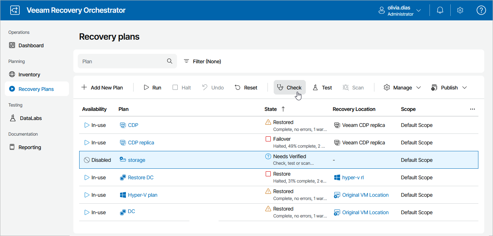
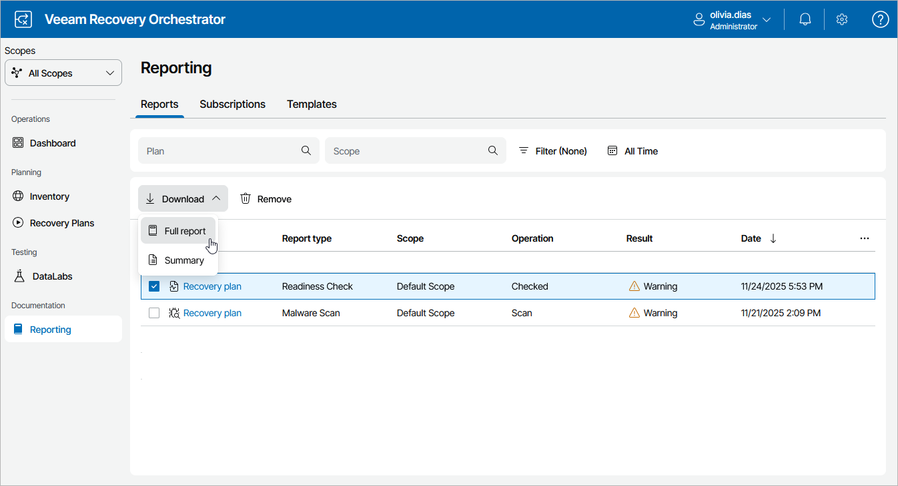
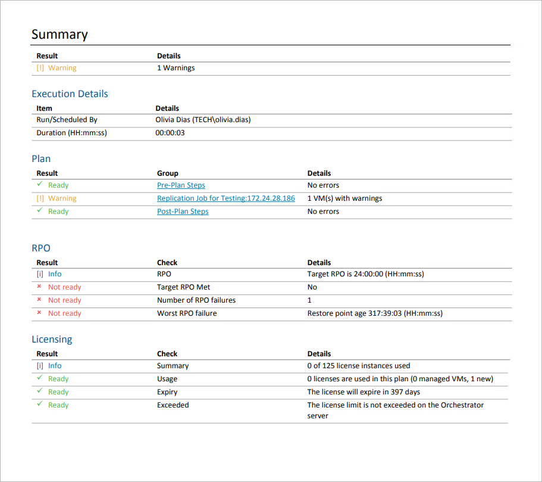

# Running Plan Readiness Check

Readiness Check is a very low-impact and fast method to confirm that configuration of a recovery plan matches the DR environment, and therefore the plan should run successfully.

The readiness check will work through every plan step to perform specific checks against each item included in a plan. It allows you to ensure the following:

* Storage systems are detected and prepared for failover.
* Datastores included in storage plans are protected by storage replication.
* Replica VMs are detected and ready for failover.
* Backups are detected and ready for restore.
* Veeam Backup & Replication servers are online and available.
* Infrastructure such as VMware vCenter, SCVMM server, NetApp and HPE storage is online and available.
* Required credentials are provided.
* Required step parameters are configured.

The readiness check is almost zero-impact and completes very quickly. It can therefore be run very frequently. For example, it is recommended that you run the readiness check in the following cases:

* After you create a plan, run the readiness check to verify whether the plan will be able to run successfully.
* After you edit a plan, run the readiness check to confirm that the changes are valid.
* After you test a plan in a DataLab, run the readiness check to confirm that replicas were shut down successfully and are ready for failover.
* After you make some changes to the virtual infrastructure, run the readiness check to confirm that recovery locations used for plans still have available resources to complete the recovery process.

Orchestrator generates two types of reports:

* A summary report that includes a plan overview and a summary of inventory groups included in the plan with drill-down hyperlinks to specific machines and color-coded results of checking every plan step.
* A full report that also includes details on the recovery location specified for the plan and information on specific steps that will run during the recovery process.

Running Plan Readiness Check Manually

By default, Orchestrator runs the readiness check automatically for every ENABLED recovery plan daily. To run the check manually for a plan:

1. Navigate to Recovery Plans.
2. Select the plan.
3. Click Check.

-OR-

From the Publish menu, select Plan Readiness Check.

As soon as the readiness check completes, the State column will display the check result. The state information (Verified, Needs Verified or Not Verified) is a rollup of the Readiness Check and DataLab test results.

|  |
| --- |
| Tip |
| Summary information on readiness check results over all scopes will be also available on the [Home Page Dashboard](home_dashboard.md). |

Downloading Plan Readiness Check Reports

To view details of the readiness check for a recovery plan:

1. Navigate to Reporting.
2. Select the report.
3. Click the plan name to download a summary report.

-OR-

Click Download and choose whether you want to download a summary or full report.

The Readiness Check Report will use the default report template or a [custom template](managing_templates.md). The results of all readiness checks will be appended at the end of the template.

