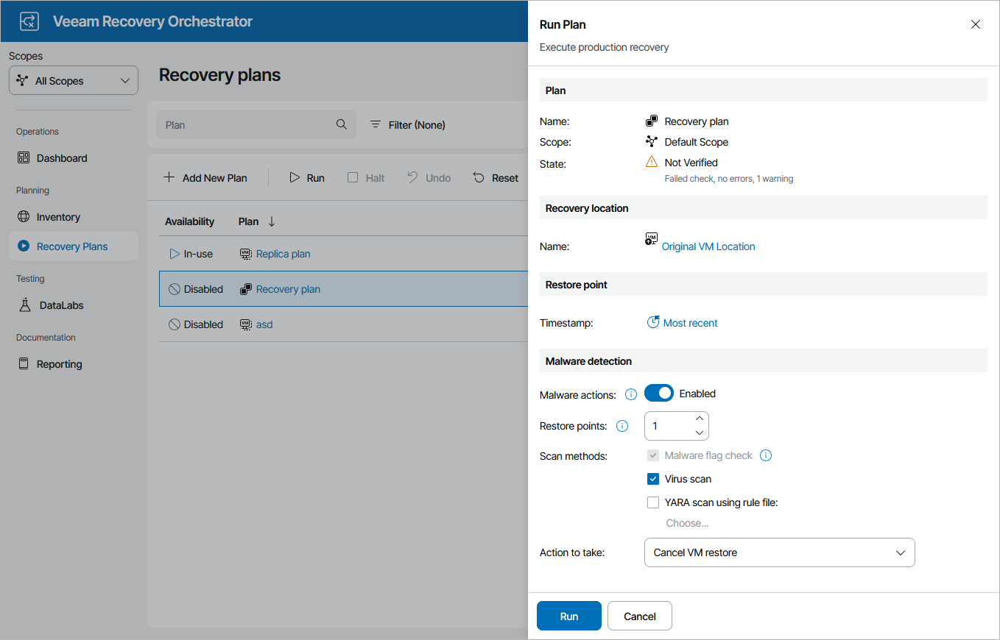

# Running Restore

The Run action causes machines in a plan to recover from their backup files. For more information on the data recovery process, see the Veeam Backup & Replication User Guide, section [Data Recovery](https://helpcenter.veeam.com/docs/vbr/userguide/data_recovery.html?ver=13).

|  |
| --- |
| Important |
| For Orchestrator to be able to perform restore in a [clean room](infrastructure_clean_room.md) in case the production Veeam Backup & Replication server becomes unavailable, you must do the following before running a restore plan:   1. Add the production backup repository to the embedded Veeam Backup & Replication server as described in the Veeam Backup & Replication User Guide, section [Backup Repositories](https://helpcenter.veeam.com/docs/vbr/userguide/backup_repository.html?ver=13). 2. Rescan the backup repository as described in the Veeam Backup & Replication User Guide, section [Rescanning Backup Repositories](https://helpcenter.veeam.com/docs/vbr/userguide/rescanning_backup_repositories.html?ver=13). Note that this process may take several minutes to complete. 3. Run the restore plan. |

To run a restore plan:

1. Navigate to Recovery Plans.
2. Select the plan and click Run.
3. In the Run Plan window, do the following:

1. For security purposes, retype your password and click Next.

You must also select the Force-enable the plan check box if you have not enabled the plan yet.

1. In the Recovery location section, click the link and select a location to which inventory groups included in the plan will be restored. For a recovery location to be displayed in the list of available locations, it must be created and added to the list of inventory items available for the scope, as described in section [Managing Recovery Locations](managing_recovery_locations.md).

If the selected recovery location includes multiple hosts, datastores and networks, Orchestrator will use the round-robin algorithm to restore machines added to the plan. For more information, see [How Orchestrator Places VMs During Restore](understanding_resource_usage_restore.md).

1. In the Restore point section, choose a restore point that will be used to recover machines.

Keep in mind that recovering data from the archive tier is not supported. If you select the Most recent option, make sure to choose a restore point that is stored in either the capacity or the performance tier. For more information on Veeam Backup & Replication tiering options, see the Veeam Backup & Replication User Guide, section [Scale-Out Backup Repository](https://helpcenter.veeam.com/docs/vbr/userguide/backup_repository_sobr.html?ver=13).

1. In the Malware detection section, choose whether you want to check restore points created for machines included in the plan for malware flags. When restoring to a VMware vSphere environment, you can also decide whether you want to scan these restore points with antivirus software, YARA rules or both.

By default, Orchestrator checks the most recent restore point on each machine. If all the restore points are infected, Orchestrator restores the machine to the selected recovery location without connecting it to any network. However, you can instruct Orchestrator to halt the plan and cancel the restore operation if no clean restore point is found.

For more information on how Orchestrator performs malware scan, see [Overview](malware_scan_overview.md).

1. Review configuration information and click Run.

   |  |
   | --- |
   | TipS |
   | * If you select a Hyper-V recovery location and if the restore plan contains a VM that still exists in this location, Orchestrator will make an attempt to replace the original VM with the restored one. If the target VM is powered on, the restore operation will complete with an error. To work around the issue, power all the plan VMs off — and then try running the plan again. * You can also scan a restore plan for possible malware without running the plan. To do that, follow the instructions provided in section [Scanning Recovery Plans](scanning_recovery_plans.md). |

   

   The plan goal is to reach the RESTORED state. If any critical error is encountered, the plan will stop with the HALTED state. To learn how to work with HALTED restore plans, see [Managing Halted Plans](managing_halted_restore_plans.md).

