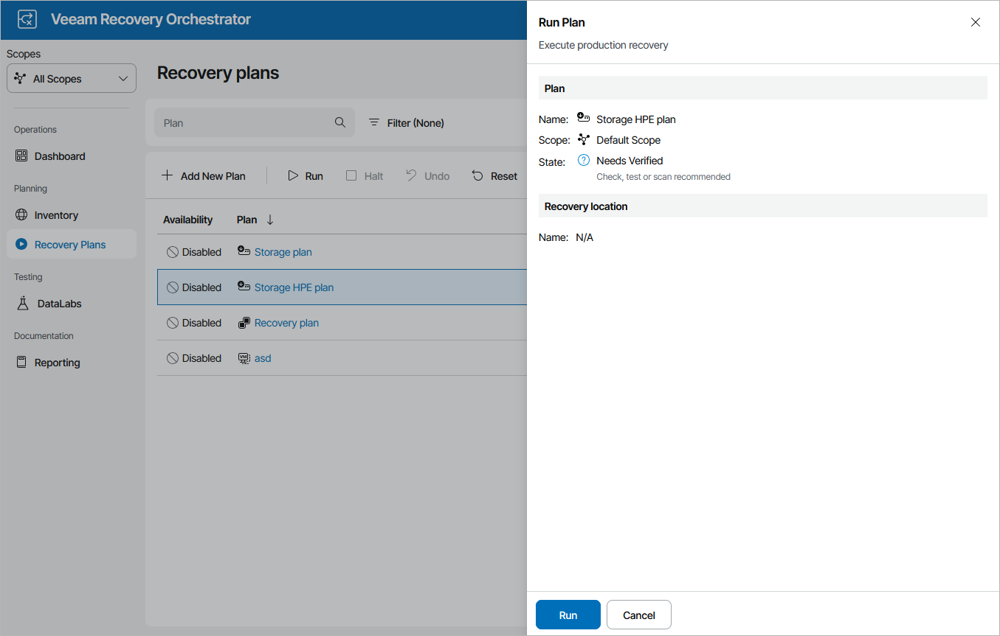

# Running HPE Storage Failover

|  |
| --- |
| Important |
| It is recommended that you do not enable the auto synchronize option for the remote copy group as it may cause performance issues during the failover process. For more information on the auto synchronize option, see [Hewlett Packard Enterprise Support Center](https://support.hpe.com/hpesc/public/docDisplay?docLocale=en_US&docId=sd00001201en_us&page=auto_synchronize_policy_about.html). |

To run an HPE storage plan:

1. Navigate to Recovery Plans.
2. Select the plan and click Run.
3. In the Run Plan window, do the following:

1. For security purposes, retype your password and click Next.

You must also select the Force-enable the plan check box if you have not enabled the plan yet.

1. Review configuration information and click Finish.

|  |
| --- |
| Note |
| For HPE storage plans, the Run Plan wizard does not offer you to choose a restore point that will be used to recover VMs. By design, Orchestrator will always use the most recent replicated data. This is a limitation of HPE storage systems. |

The plan goal is to reach the FAILOVER state. If any critical error is encountered, the plan will stop with the HALTED state. To learn how to work with HALTED storage plans, see [Managing Halted Plans](managing_halted_storage_plans.md).

|  |
| --- |
| Important |
| After the storage failover process completes, Orchestrator will leave the plan in the IN-USE mode. By design, this makes the results of the storage failover process accessible in the Orchestrator UI as long as required, and also prevents the plan from being modified by any automatic updates related to infrastructure changes.  If you want to perform any further actions with the plan (for example, to test the plan, to run readiness checks or to execute the plan again), reset the plan as described in section [Resetting Storage Plans](resetting_storage_plans.md). |

