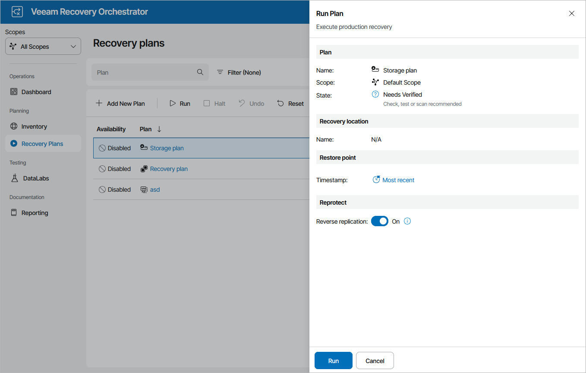

# Running NetApp Storage Failover

To run a NetApp storage plan:

1. Navigate to Recovery Plans.
2. Select the plan and click Run.
3. In the Run Plan window, do the following:

1. For security purposes, retype your password and click Next.

You must also select the Force-enable the plan check box if you have not enabled the plan yet.

1. In the Timestamp field, select a snapshot that will be used to recover VMs.

To choose target storage systems to be used to recover VMs, Orchestrator will analyze settings specified during the configuration of storage recovery locations. For more information, see [How Orchestrator Places VMs During Storage Failover](understanding_resource_usage_failover.md).

|  |
| --- |
| Note |
| This setting applies only to volumes protected by asynchronous replication. If a volume is protected by synchronous replication, Orchestrator will always use the most recent replicated data. This is a limitation of the synchronous SnapMirror technology. |

1. In the Reverse replication field, choose whether you want Orchestrator to trigger reverse replication to reprotect volumes included in the plan. This option can be useful if you plan to fail back to the production location.

If you select the to trigger reverse replication to reprotect the failed-over volumes, Orchestrator will add the Protect Storage Volumes step to the list of plan steps. This step will resynchronize the data protection relationship in the reverse direction as soon as the storage failover process completes.

Note that when running the Protect Storage Volumes step, Orchestrator only triggers the reprotect operation and reports whether the step itself started successfully — Orchestrator does not check whether the operation of resynchronizing the relationship in the reverse direction completes successfully.

For more information on ONTAP data protection, see the [NetApp ONTAP Documentation Center](https://docs.netapp.com/us-en/ontap/index.html).

|  |
| --- |
| Important |
| The Protect Storage Volumes step will interfere with the existing jobs that use storage snapshots in Veeam Backup & Replication. Since the step reverses the source and destination roles of SnapMirror relationships, these jobs will no longer function properly after the storage failover process completes.  To work around the issue, add the Veeam Job Actions step to the [list of pre-plan steps](configuring_steps.md) before running the plan. To disable a job, specify its name when [configuring the step parameters](configuring_step_parameters.md). |

1. Review configuration information and click Run.

The plan goal is to reach the FAILOVER state. If any critical error is encountered, the plan will stop with the HALTED state. To learn how to work with HALTED storage plans, see [Managing Halted Plans](managing_halted_storage_plans.md).

|  |
| --- |
| Important |
| After the storage failover process completes, Orchestrator will leave the plan in the IN-USE mode. By design, this makes the results of the storage failover process accessible in the Orchestrator UI as long as required, and also prevents the plan from being modified by any automatic updates related to infrastructure changes.  If you want to perform any further actions with the plan (for example, to test the plan, to run readiness checks or to execute the plan again), reset the plan as described in section [Resetting Storage Plans](resetting_storage_plans.md). |

