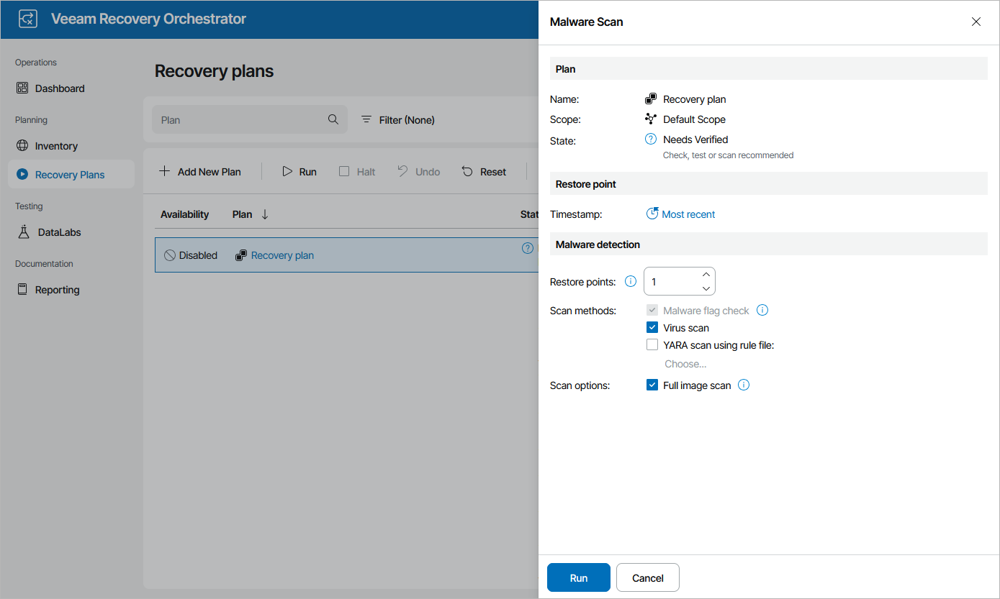

# Starting On-Demand Plan Scan

Scanning for malware may be started on-demand for a recovery plan in the ENABLED or DISABLED state. To start scanning for a plan, perform the following steps:

1. Navigate to Recovery Plans.
2. Select the necessary plan and click Scan.
3. In the Malware Scan window, do the following:

1. In the Restore Point section, choose a restore point that you want to scan.
2. In the Malware detection section, configure the following settings:

1. In the Restore points field, specify the number of restore points on each machine that you want to scan for malware.

By default, Orchestrator checks the most recent restore point. However, if you specify to scan more than 1 restore point, Orchestrator will perform scanning starting from the earliest available restore point to the most recent one. If all of the restore points are infected, the plan will acquire the NOT VERIFIED state after the scan process completes.

For more information on the way Orchestrator chooses restore points for malware scan, [How Orchestrator Selects Restore Points During On-Demand Malware Scan](understanding_restore_point_selection_malware.md).

1. [Applies only to restore and cloud plans] Decide whether you want to scan these restore points with antivirus software, YARA rules or both.

1. [Applies only if you have selected Virus scan, YARA scan using rule file or both] By design, Orchestrator scans the restore point until a virus or YARA rule match is detected. Then, Orchestrator either completes the scanning session or proceeds to the next restore point in case you have specified several restore points to scan at step 4b. However, you can instruct Orchestrator to continue scanning the restore point until all viruses and YARA rule matches are detected. To do that, select the Full image scan check box.

1. Review configuration information and click Run.

