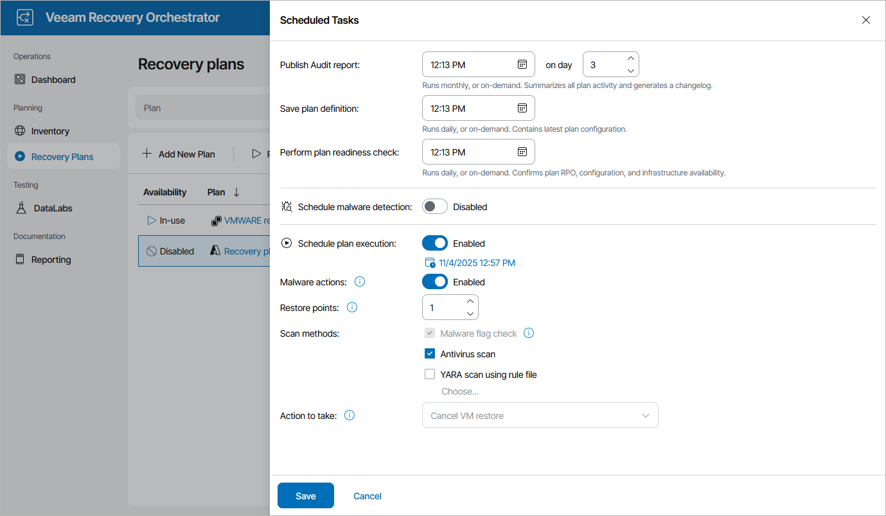

# Scheduling Cloud Restore

You can schedule a time for a cloud plan to execute. Only the restore process can be scheduled — all other operations must be performed manually in the Orchestrator UI.

To schedule a cloud plan:

1. Navigate to Recovery Plans.
2. Select the plan. From the Manage menu, select Schedule.

-OR-

Right-click the plan name and select Manage > Schedule.

1. In the Scheduled Tasks window, do the following:

1. Set the Schedule plan execution toggle to Enabled.
2. Click the Configure schedule link and choose whether you want to run the plan on schedule or after any other plan:

* If you want to run the plan at a specific time, click the Schedule icon in the Run on field, set the desired date and time, and click Apply.

* If you want to run the plan after another plan, select the Schedule after plan check box and click Choose plan. Then, in the Select Plan window, select the necessary plan and click Apply.

For a plan to be displayed in the list of available plans, it must be ENABLED as described in section [Running and Scheduling Cloud Plans](running_cloud_plans.md).

1. Set the Malware actions toggle to Enabled if you want to check restore points created for machines included in the plan for malware flags. You can also decide whether you want to scan these restore points with antivirus software, YARA rules or both.

By default, Orchestrator checks the most recent restore point on each machine. If no clean restore point is found, Orchestrator performs the following actions depending on whether you have specified a quarantine network when configuring the cloud recovery location:

* In case you have specified a quarantine network, Orchestrator connects the machine to the network.
* In case you have not specified a quarantine network, Orchestrator halts the plan and cancels the restore operation.

For more information on how Orchestrator performs malware scan, see [Overview](malware_scan_overview.md).

1. Review configuration information and click Save.

|  |
| --- |
| Tip |
| You can also scan a recovery plan for possible malware without scheduling the plan execution. To do that, follow the instructions provided in section [Scanning Recovery Plans](scanning_recovery_plans.md). |

|  |
| --- |
| Tip |
| You can disable a configured schedule if you no longer need it. To do that, set the Schedule plan execution toggle to Disabled in the Scheduled Tasks window. |

