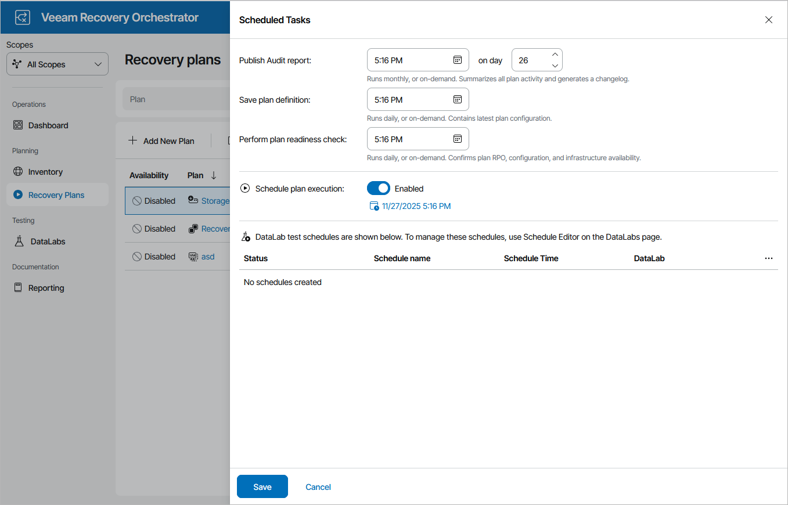

# Scheduling Storage Failover

You can schedule a time for a storage plan to execute. Only the failover process can be scheduled — all other operations must be performed manually in the Orchestrator UI.

|  |
| --- |
| Note |
| If you configure a schedule for a storage plan, Orchestrator will not be able to trigger reverse replication to reprotect volumes included in the plan — this option is available only when you [run the storage failover process manually](running_storage_failover.md). |

To schedule a storage plan:

1. Navigate to Recovery Plans.
2. Select the plan. From the Manage menu, select Schedule.

-OR-

Right-click the plan name and select Manage > Schedule.

1. In the Scheduled Tasks window, do the following:

1. Set the Schedule plan execution toggle to Enabled.
2. Click the Configure schedule link and choose whether you want to run the plan on schedule or after any other plan:

* If you want to run the plan at a specific time, click the Schedule icon in the Run on field, set the desired date and time, and click Apply.
* If you want to run the plan after another plan, select the Schedule after plan check box and click Choose plan. Then, in the Select Plan window, select the necessary plan and click Apply.

For a plan to be displayed in the list of available plans, it must be ENABLED as described in section [Running and Scheduling Storage Plans](running_storage_plans.md).

1. Review the configuration information and click Save.

|  |
| --- |
| Tip |
| You can disable a configured schedule if you no longer need it. To do that, set the Schedule plan execution toggle to Disabled in the Scheduled Tasks window. |

