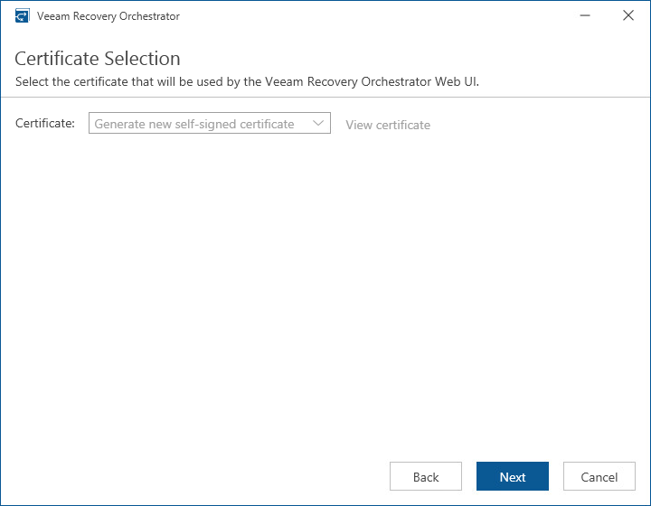

# Step 14. Select Certificate for Orchestrator UI

[This step applies only if you have clicked the Customize Settings at the Ready to Install step of the setup wizard]

At the Certificate Selection step of the wizard, choose an SSL certificate that will be used to secure traffic between the Orchestrator UI and a web browser.

You can choose an existing certificate installed on the machine (self-signed or provided by CA) or generate a new self-signed certificate. If you generate or choose a self-signed certificate, you must configure a trusted connection between the Orchestrator UI and a web browser later. For more information, see [Configuring Trusted Connection](accessing_vro_ui.md#trustedconnection).

|  |
| --- |
| Important |
| For an existing certificate to be displayed in the Certificate list, the following prerequisites must be met:   * The certificate signature algorithm must be Secure Hash Algorithm 2 (SHA-2) or later. * The certificate cryptography algorithm must be RSA with a key of 2048 bits in length or longer. * The certificate must contain the Key Encipherment and Data Encipherment key usage.  * The certificate must be added to the Trusted Root Certificate Authorities store for the machine where Orchestrator is installed.  * The certificate must be added to the Certificates > Personal folder in the Microsoft Management Console snap-in. To learn how to move SSL certificates, see [this Microsoft KB article](https://docs.microsoft.com/en-us/previous-versions/windows/it-pro/windows-server-2008-R2-and-2008/cc771103%28v%3Dws.11%29). |

