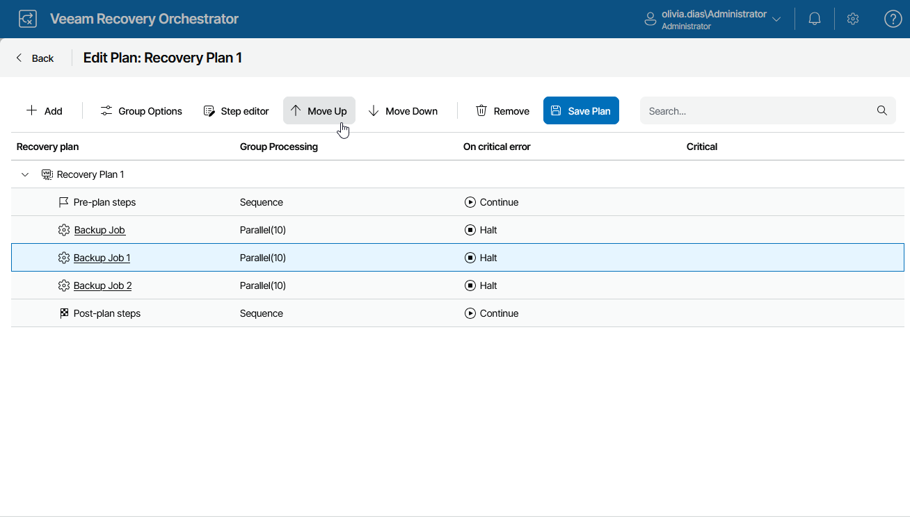

# Setting Group Processing Order

Inventory groups in a recovery plan are processed in the order they appear in the Recovery plan list. If some machines in a group are dependent upon machines in other groups, make sure that the required group is recovered first.

To change the processing order for inventory groups included in a recovery plan:

1. Navigate to Recovery Plans.
2. Select the plan for which you want to change the group processing order and click Manage > Edit.
3. On the Edit Plan page, do the following:

1. Expand the plan to see all its inventory groups and select an inventory group whose processing order you want to change.
2. To move the group up or down the list, use the Move Up and Move Down arrows.
3. To save changes made to the plan settings, click Save Plan.

|  |
| --- |
| Note |
| By design, each recovery plan contains 2 default groups — Pre-plan steps and Post-plan steps. These groups include plan steps that run before and after the recovery process. You cannot change the processing order for the Pre-plan steps and Post-plan steps groups, but you can add and remove steps for these groups. For more information, see [Configuring Steps](configuring_steps.md). |

