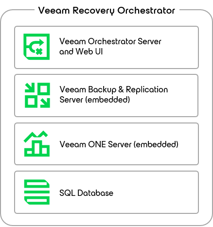

# Solution Architecture

This section provides information on the Orchestrator architecture and its components, and describes some common [deployment scenarios](deployment_scenarios.md). The main components in the Orchestrator architecture are:

* [Veeam Orchestrator Server](#vroserver)
* [Veeam Backup & Replication Servers](#vbrservers)

Optionally, additional infrastructure required for recovery can be connected, for example:

* [NetApp Storage Systems](#storagesystems_netapp)
* [HPE Storage Systems](#storagesystems_hpe)
* [vCenter Servers](#vcservers)
* [SCVMM Servers](#hypervservers)
* [Hyper-V and Azure Local Clusters](#hypervclusters)

Veeam Orchestrator Server

The Orchestrator server is the configuration, administration and management core of the Orchestrator architecture. This is where recovery plans are created, audited, tested and executed. Internally, the Orchestrator server is comprised of the following components:

* Veeam Orchestrator Server Service — is responsible for managing recovery plans, and administering user roles and permissions.
* Veeam Orchestrator Web UI — is a web-based user interface that allows users to interact with the Veeam Orchestrator Server Service, and to perform various configuration and administration actions.
* Veeam Backup & Replication Server — is installed with the Orchestrator server to supply Veeam PowerShell libraries and support certain disaster recovery scenarios. It is referred to as an "embedded" server. The server works as a fully functional Veeam Backup & Replication server.
* Veeam ONE Server — handles the Veeam ONE Business View engine to gather inventory. This is a fully functional edition of Veeam ONE. It is referred to as a "embedded" server.
* SQL Server — is used to host configuration data. A Microsoft SQL Server Express instance can be installed locally. However, for best performance and scalability, Microsoft SQL Server Enterprise edition is recommended, which may be a remote server.

All Orchestrator components can be deployed on a single Windows-based physical or virtual machine using the unified installer.

|  |
| --- |
| Important |
| Installation of the Orchestrator server on a machine already running Veeam Backup & Replication or Veeam ONE is not supported. |

Veeam Backup & Replication Servers

Deploy an Orchestrator agent to each of your Veeam Backup & Replication servers to orchestrate the recovery of protected machines.

[Optional] vCenter Servers

All vCenter Servers that manage protected VMs, or that will host recovered backups, must be connected to the Orchestrator server.

Veeam Recovery Orchestrator 13 allows you to recover VMs to vCenter Servers managed by VMware Cloud Director. For more information, see the Veeam Backup & Replication User Guide, section [Backup for VMware Cloud Director](https://helpcenter.veeam.com/docs/vbr/userguide/vcloud_director_backup.html?ver=13).

|  |
| --- |
| Note |
| You can recover only VMs protected by VMware Cloud Director backup jobs. Recovering VMs protected by VMware Cloud Director replication and CDP replication jobs is not supported. |

[Optional] SCVMM Servers

All System Center Virtual Machine Manager (SCVMM) servers that manage protected VMs, or that will host recovered backups, must be connected to the Orchestrator server.

|  |
| --- |
| Important |
| To allow Orchestrator to connect to an SCVMM server, you must first install the SCVMM console on the machine that runs Orchestrator as described [in Microsoft Docs](https://learn.microsoft.com/en-us/system-center/vmm/install-console?view=sc-vmm-2025). |

[Optional] Hyper-V and Azure Local Clusters

All standalone Hyper-V and Azure Local clusters that will host recovered backups must be connected to the Orchestrator server — either as a direct connection or as part of an SCVMM hierarchy.

[Optional] NetApp Storage Systems

All NetApp storage systems must be connected to the Orchestrator server. That is, you must connect source and target storage virtual machines (SVMs) that manage the source volumes hosting VM disks and configuration files, and SVMs that manage the replicated volumes.

|  |
| --- |
| Note |
| You can connect only SVMs to the Orchestrator server. Connections to NetApp clusters and nodes are not supported. |

[Optional] HPE Storage Systems

All HPE storage systems must be connected to the Orchestrator server. That is, you must connect storage systems that manage volumes hosting VM disks and configuration files, and storage systems that manage volumes storing replicated data.

|  |
| --- |
| Note |
| You can connect only storage systems to the Orchestrator server. Connections to StoreServ Management Consoles are not supported. |

