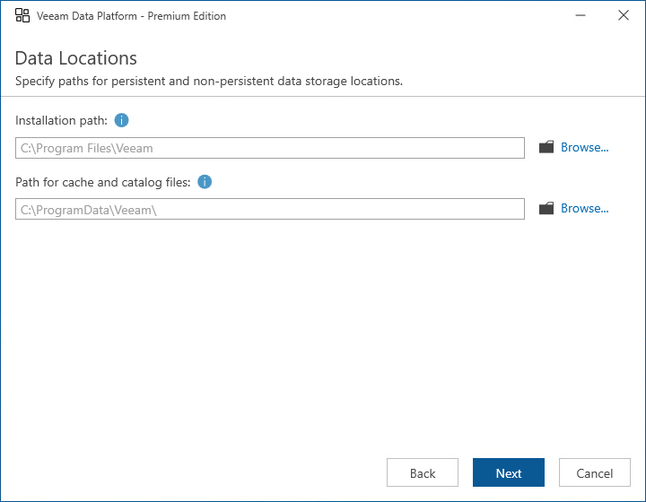

# Step 12. Specify Data Locations

[This step applies only if you have clicked Customize Settings at the Ready to Install step of the setup wizard]

At the Data Locations step of the wizard, specify a path to the folder where Orchestrator components will be installed.

You can also specify a path to the folder where Veeam ONE and Veeam Backup & Replication components will store index files and write cache. By design, the setup wizard will automatically create the following subfolders in the specified folder:

* \VBRCatalog — the subfolder where Veeam Backup & Replication index files will be stored; the subfolder is created on the volume with the maximum amount of free space.
* \PerCache — the subfolder where Veeam ONE write cache will be stored.
* \Backup\IRCache — the subfolder where the write cache for machines that are started from backups during recovery verification or restore operations will be stored; make sure that you have at least 10 GB of free disk space for this subfolder.

