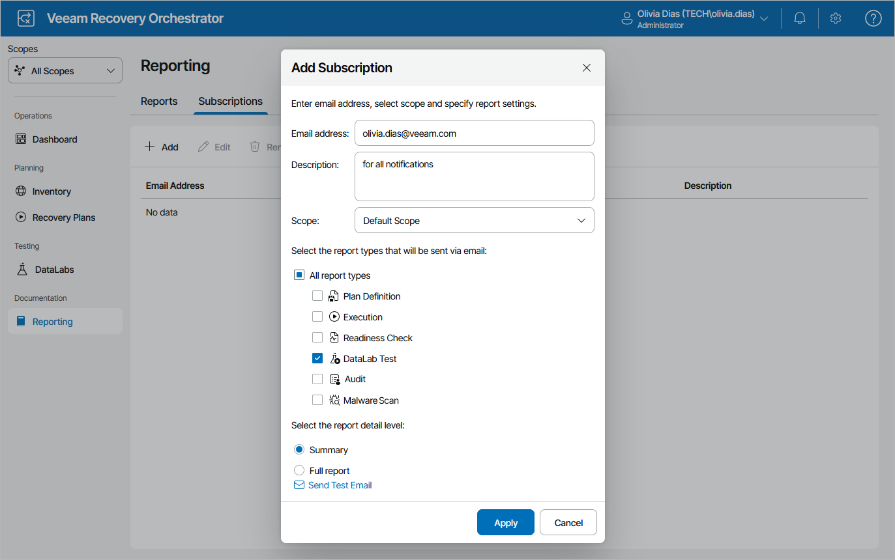

# Step 2. Specify Report Subscription Settings

Add email addresses that will receive report notifications for your Orchestrator server. These addresses will be available for subscription for [all created scopes](managing_scopes.md).

To add recipients and subscribe them to the desired reports:

1. Navigate to Reporting > Subscriptions.
2. Click Add.
3. In the Add Subscription window:

1. In the Email address field, enter an email address of a recipient.
2. In the Description field, enter a short description for the recipient, if required.
3. From the Scope drop-down list, select a scope for which you want to create subscriptions.
4. Select check boxes next to the report types this address will be subscribed to.
5. Select whether you want to subscribe to a summary or full report.
6. The Orchestrator UI allows you to send a test message to check whether you have configured email settings correctly. To do that, click Send Test Email. A test email will be sent to the specified email address.
7. Click Apply.

