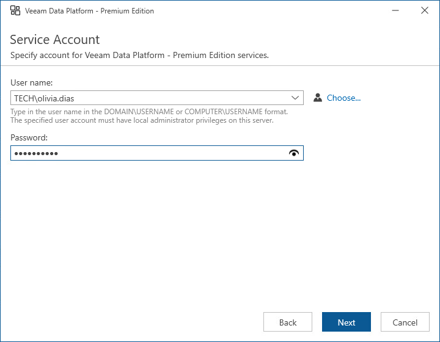

# Step 6. Specify Service Account Credentials

At the Service Account step of the wizard, enter credentials of the account under which the Veeam Data Platform – Premium Edition services will run. The account must be a member of the local Administrators group. The user name must be specified either in the DOMAIN\USERNAME or in the USERNAME format.

