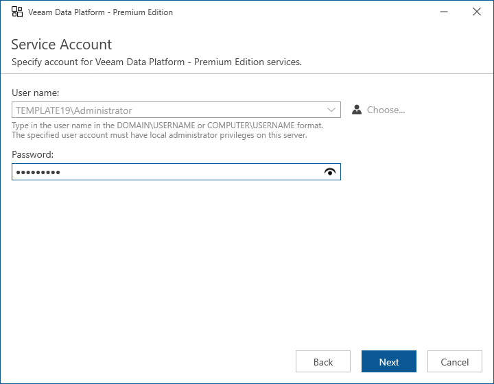

# Step 6. Specify Service Account Credentials

The installer will automatically detect the account that was previously used to run the Veeam Orchestrator Server Service. At the Service Account step of the wizard, enter the password for the account.

