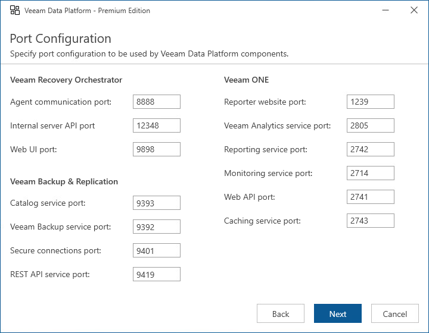

# Step 13. Specify Service Ports

[This step applies only if you have clicked Customize Settings at the Ready to Install step of the setup wizard]

At the Port Configuration step of the wizard, customize the following ports:

* Veeam Recovery Orchestrator communication ports that will be used for collecting data from connected servers, and for accessing the Orchestrator UI through a web browser.
* Veeam Backup & Replication communication ports that will be used for communication between Orchestrator and Veeam Backup & Replication components, and for connecting to the REST API functionality.
* Veeam ONE communication ports that will be used for communication between Orchestrator and Veeam ONE components, and for connecting to the REST API functionality.

For the full description of ports used by Orchestrator and their default values, see [Ports](ports.md).

