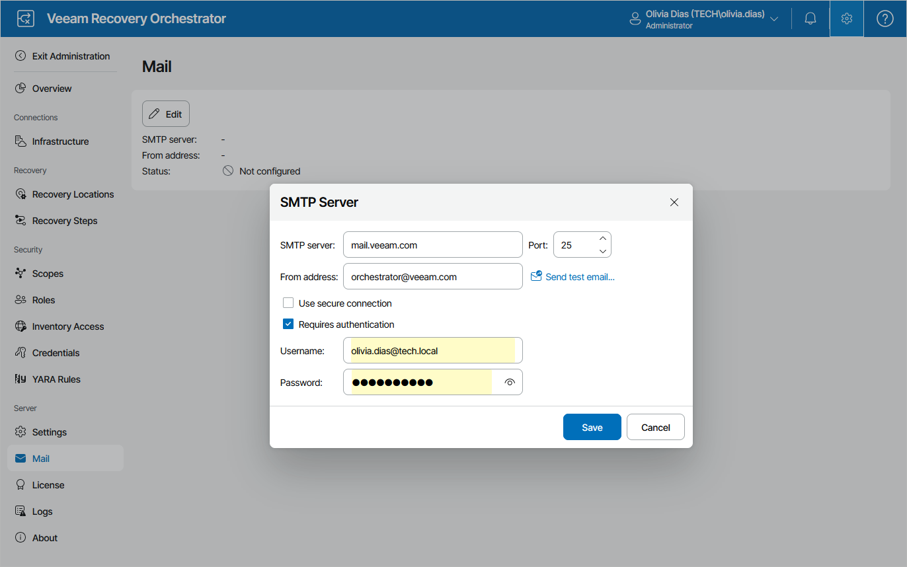

# Step 1. Specify Email Server Settings

To connect an SMTP server that will be used for sending email notifications:

1. Switch to the Administration page.
2. Navigate to Mail.
3. Click Edit.
4. In the SMTP Server window:

1. In the SMTP Server field, enter a DNS name or an IPv4 address of the SMTP server. All email notifications (including test messages) will be sent by this SMTP server.
2. In the Port field, change the SMTP communication port if required. The default SMTP port is 25.
3. In the From address field, enter an email address of the notification sender. This email address will be displayed in the From field of notifications.
4. For an SMTP server with SSL/TLS support, select the Use secure connection check box to enable SSL data encryption.
5. If your SMTP server requires authentication, select the Requires authentication check box, and specify authentication credentials in the Username and Password fields.
6. The Orchestrator UI allows you to send a test message to check whether you have configured all settings correctly. To do that, click Send test email.
7. Click Save.

