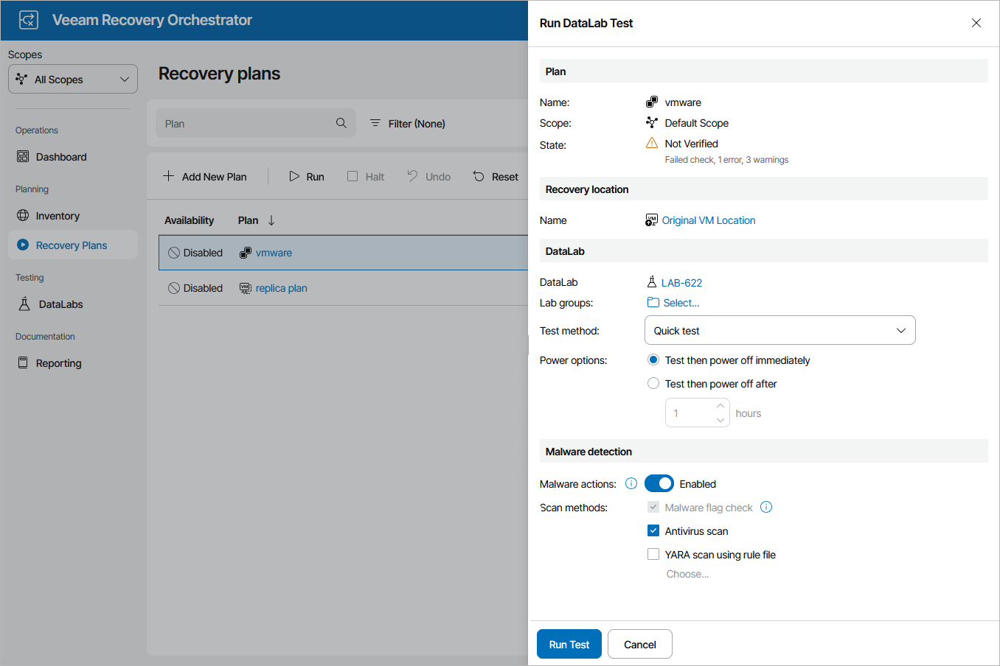

# Starting On-Demand Plan Test

DataLab testing can be started on-demand for any recovery plan in the ENABLED or DISABLED state. To start testing for a plan, perform the following steps:

1. Navigate to Recovery Plans.
2. Select the necessary plan and click Test.
3. In the Run DataLab Test window, do the following:

1. In the DataLab field, select a DataLab in which the plan will be verified.For a DataLab to be displayed in the DataLab list, it must be added to the scope as described in section [Managing Inventory Items](managing_inventory_items.md).
2. In the Lab groups field, click Select and add the necessary lab groups required to support the test environment. For a lab group to be displayed in the Group list, it must be created and configured as described in section [Creating Lab Groups](creating_lab_groups.md).

Note that all default lab groups previously created by Administrators will automatically become preselected in the Group list, and you will not be able to remove them. For more information, see [Working with Default Lab Groups](default_lab_groups.md).

1. [Applies only to restore plans] In the Test method field, choose whether you want to verify both backups of plan machines and the recovery location used to restore the machines, or backups only.

* If you select the Quick test option, Orchestrator will verify whether machines included in the plan will be able to recover from their backup files.

In this case, plan machines will be verified in the Instant VM Recovery environment.

* If you select the Full restore to target storage option, Orchestrator will not only verify that vSphere and agent backups are ready-to-use, but also check that the recovery location to which the machines will be restored is available and has enough resources to support the recovery process.

In this case, you must also specify the location explicitly — to do that, click the link in the in the Recovery location section. For a recovery location to be displayed in the list of available recovery locations, it must be created and added to the list of inventory items available for the scope, as described in section [Managing Recovery Locations](managing_recovery_locations.md).

In both cases, Orchestrator will run all verification steps added to the plan to make sure that the plan will be able to complete successfully.

|  |
| --- |
| Tips |
| * For the test to run successfully, you must map isolated networks of the virtual lab to all target networks present in the [network mapping table](restore_location_network_mapping.md) of the selected recovery location. In case you want any of the recovered VMs to be connected to the same networks as the source machines, you must map isolated networks of the virtual lab to those source networks.   To do that, configure the Isolated Networks settings of the virtual lab in the Veeam Backup & Replication console, as described in the Veeam Backup & Replication User Guide, section [Recovery Verification](https://helpcenter.veeam.com/docs/vbr/userguide/recovery_verification_overview.html?ver=13).   * If you have selected the Quick test option at the Test method step of the wizard, you can only select a location that has [Instant VM Recovery enabled](restore_location_recovery_options.md).   If you want to test the plan using a location with Instant VM Recovery enabled (location A) but then to restore to a location with Instant VM Recovery disabled (location B), clone the location B and change the Instant VM Recovery setting for the clone. Then, use the location A for testing and the location B for the recovery. |

1. In the Power options field, choose an action to perform after the plan testing process is over:

* To keep all plan VMs and the lab running in case you are willing to perform further tests, select the Test then power off after option. This option will book a time slot in the lab schedule and prevent other tests from being scheduled for the same period.
* To power off all plan VMs and the lab, select the Test then power off immediately option.

Note that if you have selected a starting or running lab at step 3a, the lab will not be powered off after the plan testing process is over — even if the Test then power off immediately is selected. In this case, Orchestrator will power off only plan VMs and keep the lab running.

1. In the Malware detection section, choose whether you want to check restore points created for machines included in the plan for malware flags. For restore plans, you can also decide whether you want to scan these restore points with antivirus software, a YARA rule or both.

By design, Orchestrator checks only the most recent restore point for each machine and stops plan testing if the restore point is marked as Suspicious or Infected. However, if this restore points is created for a machine added to a lab group, Orchestrator issues a warning and continues plan testing. For more information, see [Malware Scan](malware_scan_overview.md).

1. Review configuration information and click Run Test.

The lab will power on, start lab groups and begin testing the plan. If the lab halts, the plan will fail to be tested. To learn how to resume plan testing, see [Managing Halted Replica Plans](resuming_replica_plan_testing.md), [Managing Halted Storage Plans](resuming_storage_plan_testing.md), [Managing Halted Restore Plans](resuming_restore_plan_testing.md) or [Managing Halted CDP Replica Plans](resuming_cdp_plan_testing.md).

|  |
| --- |
| Note |
| As soon as the test is over, the [DataLab Test Report](viewing_test_execution_history.md) will be generated. The plan and the DataLab will be powered off or will keep running, depending on the power options chosen in the Run DataLab Test window. Keep in mind that even if you have enabled the Test then power off after option, the test will be considered to be completed when all plan steps have been run, and the DataLab Test Report will be generated at that point. |

If you want to receive notifications on errors that occur while powering off the DataLab, you must connect an SMTP server, add recipients and subscribe to DataLab Test reports as described in section [Configuring Notification Settings](configuring_notifications.md).

