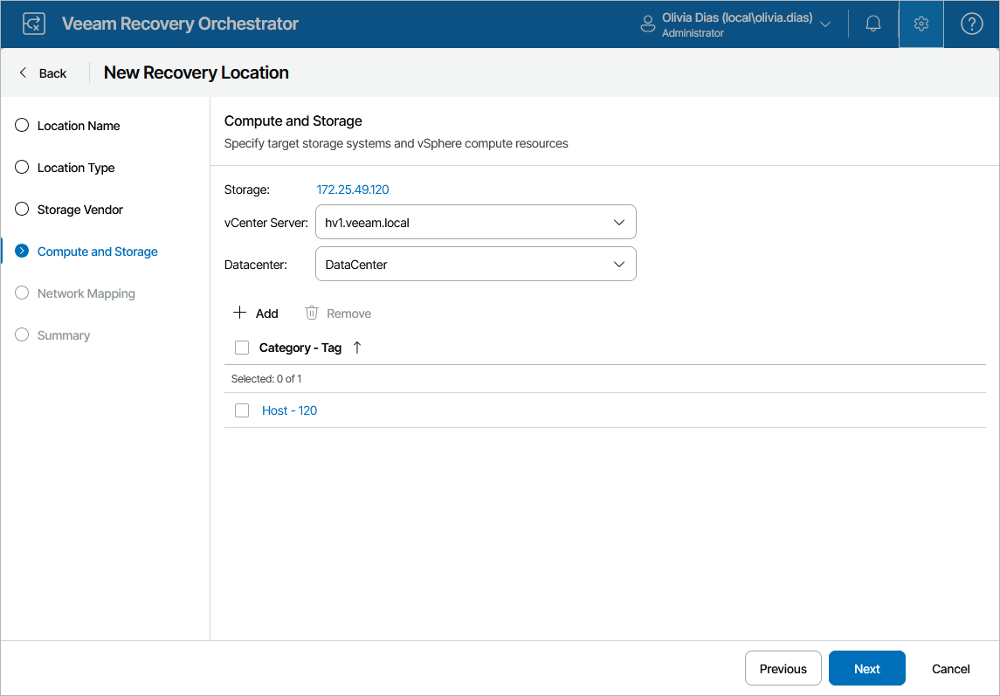

# Step 4. Specify Compute and Storage Resources

At the Compute and Storage step of the wizard, configure the following settings:

1. Click the link in the Storage field and specify target storage systems to be used to recover VMs. To do that, select the required storage systems in the list of available systems and click Save.

To view datastores included in a storage system, click the system name in the Storage System list.

1. From the vCenter Server drop-down list, select a vCenter Server that will manage recovered VMs.
2. From the Datacenter drop-down list, select a datacenter to be used to recover VMs. The recovered VMs will be distributed across resources of this datacenter.
3. Click Add to specify target hosts and clusters to which recovered volumes will be mounted. To do that, select resource groups in the list of available groups and click Save.

For compute resources to be displayed in the Category list, these resources must be categorized into groups in Veeam ONE Client as described in the Veeam Recovery Orchestrator Group Management Guide and must belong to the datacenter selected at step 3. If a resource group belongs to multiple datacenters at the same time, it will not be displayed in the list.

To view hosts and clusters included in a resource group, click the group name in the Category list.

|  |
| --- |
| Important |
| If you add a host to a recovery location and then move the host to another datacenter, or if you move a host from one vCenter Server to another, the host will be assigned a new vCenter MoRef ID, Orchestrator will consider the host to be a new infrastructure object, and the configuration of the recovery location will become invalid. As a result, Orchestrator will not be able to use this location for recovery. |

