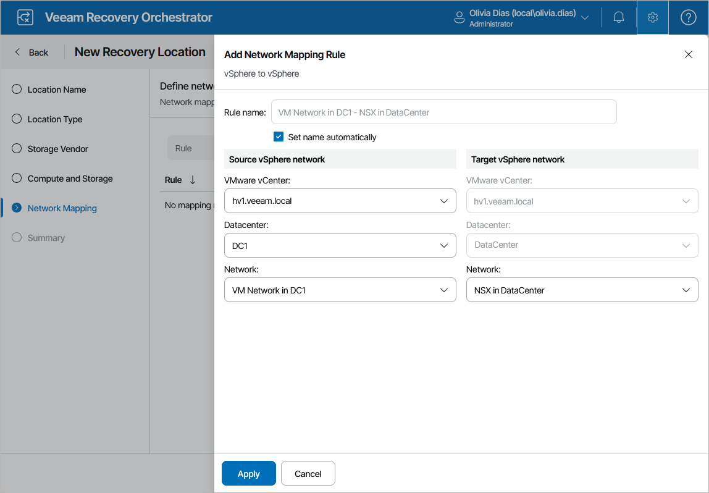
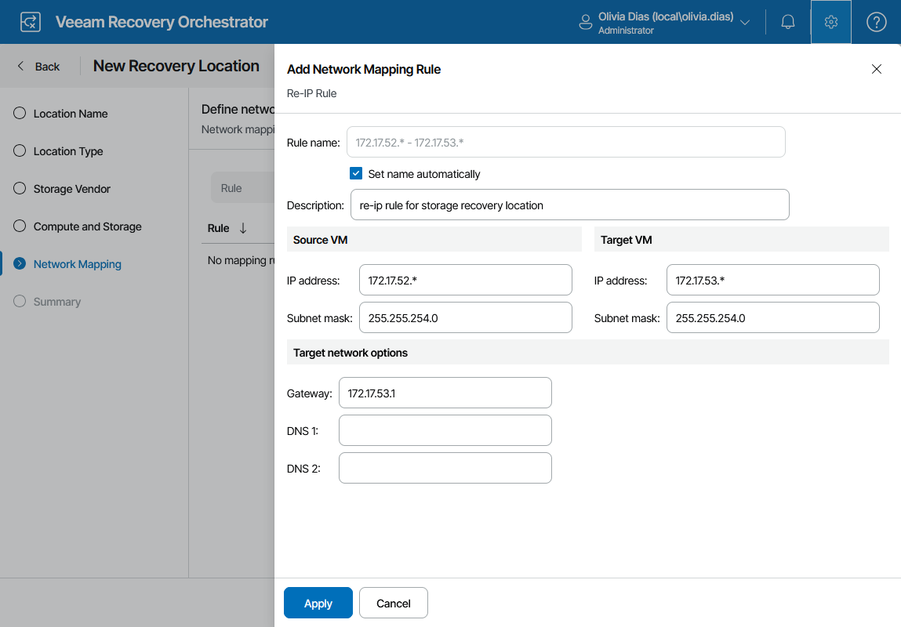

# Step 5. Configure Network Mapping

[This step applies only if you want to enable the functionality of network mapping]

By default, a recovered VM is connected to the same networks as the source VM. If the network configuration in the recovery location does not match the production network configuration, you can create a network mapping table for the location so that the recovered VM is connected to the correct network.

At the Network Mapping step of the wizard, click Add Mapping > vSphere to vSphere to configure network mapping. Then, do the following in the Add Network Mapping Rule window:

1. In the Source vSphere network section, select a vCenter Server that manages source VMs, a network to which the source VMs are connected, and a datacenter where the source VMs reside.

For a vCenter Server to be displayed in the VMware vCenter list, it must be connected to Orchestrator as described in section [Connecting VMware vSphere Servers](connecting_vsphere_servers.md).

1. In the Target vSphere network section, select a vCenter Server that will manage recovered VMs, a network to which the recovered VMs will be connected, and a datacenter or a cluster where the target VMs will reside.

Since [you have already specified the target datacenter](storage_location_compute_resources.md#datacenter) to be used, the wizard only allows you to change the target network.

Configuring Re-IP Rules

[This step applies only if you want to enable the functionality of automatic IP address transformation for recovery of Microsoft Windows servers]

If the network configuration in the source location does not match the production network configuration, you can create re‑IP rules for the recovery location, and Orchestrator will automatically reconfigure IP addresses of the recovered VMs. During storage failover, Orchestrator checks if any of the re-IP rules will apply to the recovered VM: if a rule applies, Orchestrator will change the IP address configuration of the recovered VM using the Microsoft Windows registry.

|  |
| --- |
| Important |
| To allow Orchestrator to reconfigure IP addresses of a recovered VM, the VM must have VMware Tools installed. |

To configure a re-IP rule, click Add Mapping > Re-IP Rule. Then, do the following in the Add Network Mapping Rule window:

1. In the Description field, specify a brief outline for the rule or leave any related comments.
2. In the Source VM section, describe an IP numbering scheme adopted in the source location.
3. In the Target VM section, describe an IP numbering scheme adopted in the target location.
4. In the Target network options section, specify a default gateway that will be used for recovered VMs.

If necessary, define the DNS server addresses.

1. Click Apply.

|  |
| --- |
| Tip |
| You can use the asterisk character (\*) to specify a range of IP addresses. |

