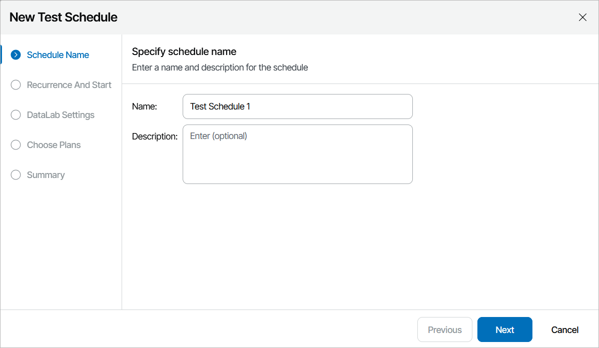

# Step 1. Specify Schedule Name and Description

At the Schedule Name step of the wizard, use the Name and Description fields to enter a name for the new schedule and to provide a description for future reference. The maximum length of the schedule name is 128 characters; the following characters are not supported: \* : / \ ? " < > | .

