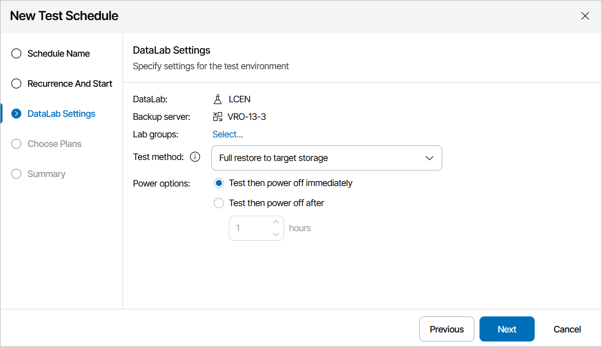

# Step 3. Add Lab Groups

At the DataLab Settings step of the wizard, add the required lab groups to support the test environment.

For a lab group to be displayed in the Group list, it must be created and configured as described in section [Creating Lab Groups](creating_lab_groups.md).

|  |
| --- |
| Note |
| All default lab groups previously created by an Administrator will automatically become preselected in the Lab Groups to use list, and you will not be able to remove them. For more information, see [Working with Default Lab Groups](default_lab_groups.md). |

Additionally, you can configure the following settings:

* From the Test method drop-down list, choose whether you want to verify both backups of plan machines and the recovery location used to restore the machines, or backups only.

* If you select the Instant VM recovery option, Orchestrator will check whether machines included in the plan will be able to recover from their backup files.

In this case, plan machines will be verified in the Instant VM Recovery environment.

* If you select the Full restore to target storage option, Orchestrator will not only verify that vSphere and agent backups are ready-to-use, but also check that the recovery location to which the machines will be restored is available and has enough resources to support the recovery process.

In this case, Orchestrator will run all verification steps added to the plan to make sure that the plan will be able to complete successfully.

|  |
| --- |
| Tip |
| For the test to run successfully, you must map isolated networks of the virtual lab to all target networks present in the [network mapping table](restore_location_network_mapping.md) of the selected recovery location. In case you want any of the recovered VMs to be connected to the same networks as the source machines, you must map isolated networks of the virtual lab to those source networks.  To do that, configure the isolated networks settings of the virtual lab in the Veeam Backup & Replication console, as described in the Veeam Backup & Replication User Guide, section [Recovery Verification](https://helpcenter.veeam.com/docs/vbr/userguide/recovery_verification_overview.html?ver=13). |

* In the Power Options field, choose an action to perform after the plan testing process is over:

* To power off all plan machines and the lab, select the Test then power off immediately option.
* To keep plan all machines and the lab running in case you are willing to perform further tests, select the Test then power off after option.

Use the Test then power off after field to book a time slot in the lab schedule and prevent other tests from being scheduled for the same period.

|  |
| --- |
| Note |
| If you have selected a starting or running lab, the lab will not be powered off after the plan testing process is over — even if the Test then power off immediately option is selected. In this case, Orchestrator will power off only plan machines and keep the lab running. |

