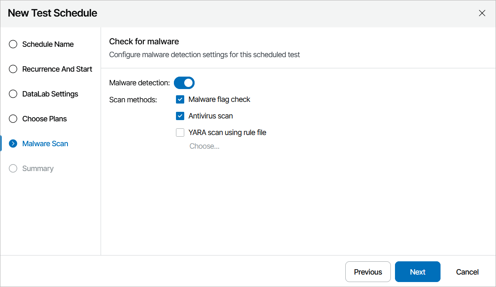

# Step 5. Run Malware Scan

[This step applies only if you have included at least one restore, replica or CDP replica plan in the Plan name list at the [Choose Plans](test_schedule_plans.md) step of the wizard]

At the Malware Scan step of the wizard, choose whether you want to check restore points created for machines included in the plan for possible for malware flags. You can also decide whether you want to scan these restore points with antivirus software, a YARA rule or both.

By design, Orchestrator checks only the most recent restore point for each machine and stops plan testing if the restore point is marked as Suspicious or Infected. For more information, see [Malware Scan](malware_scan_overview.md).

