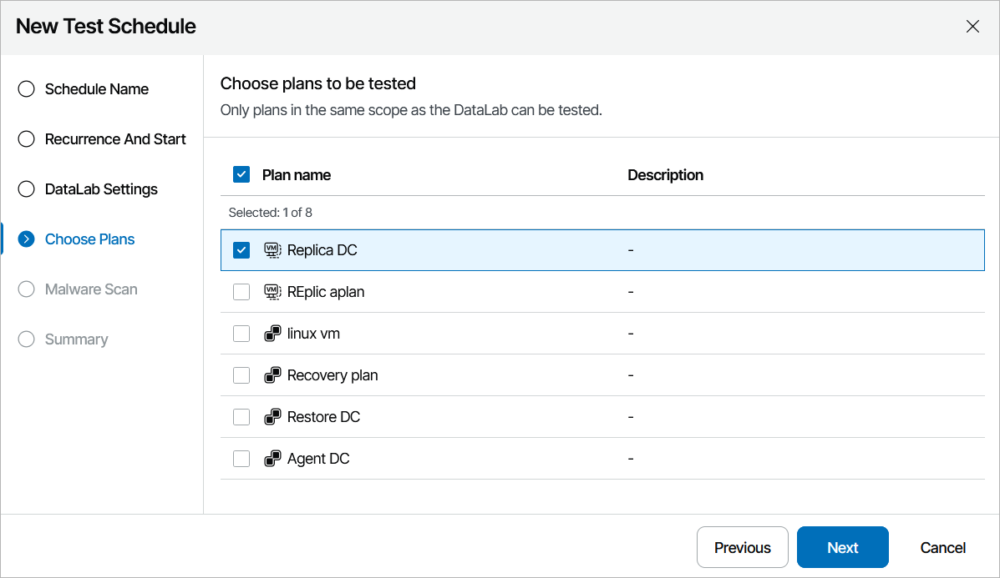

# Step 4. Select Plans

At the Choose Plans step of the wizard, select recovery plans to be tested in a DataLab.

|  |
| --- |
| Note |
| If you select multiple plans, they all will be tested at the same time. |

