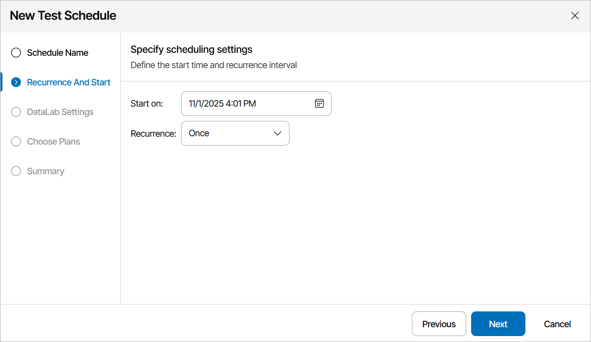

# Step 2. Specify Scheduling Settings

At the Recurrence and Start step of the wizard, define scheduling settings for the lab:

1. Click the Schedule icon in the Start on section to configure the necessary schedule, and click Apply.
2. In the Recurrence section, choose the necessary option:

* Once — to test plans once on the specified day.
* Weekly on — to start testing once a week on the specified day.
* Monthly on — to start testing once a month on the specified day.

