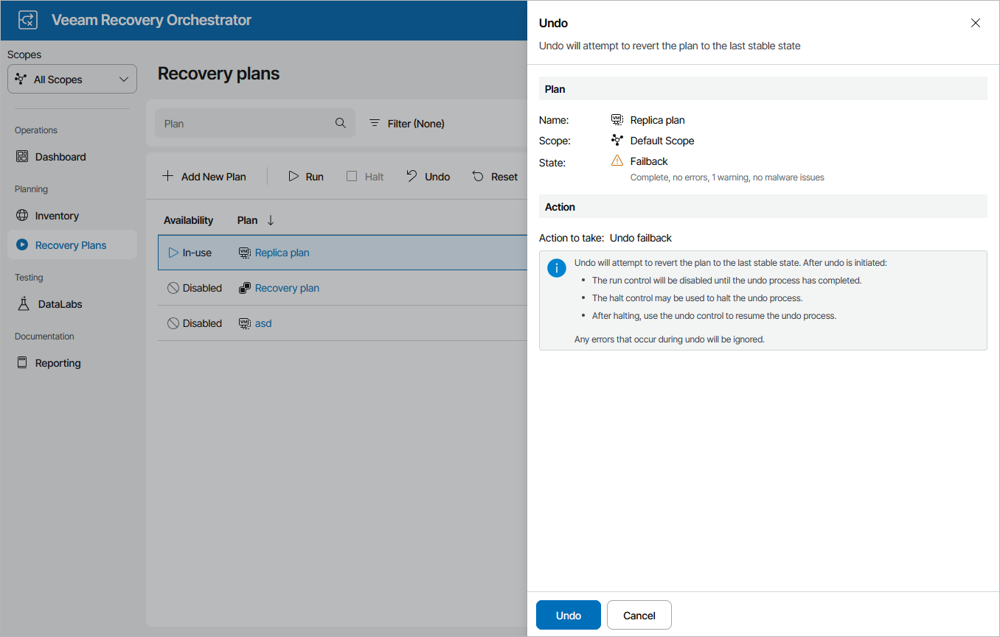

# Undoing Failback

The Undo Failback action powers on VM replicas running on target hosts and switches from the production VMs back to the VM replicas — as a result, the plan acquires the FAILOVER state. For more information on the undo failback operation, see the Veeam Backup & Replication User Guide, section [Undo Failback](https://helpcenter.veeam.com/docs/vbr/userguide/undo_failback.html?ver=13).

To perform an undo operation for a plan in the PREPARE FOR FAILBACK or FAILBACK state:

1. Navigate to Recovery Plans.
2. Select the plan and click Undo.
3. In the Undo window, do the following:

1. For security purposes, retype your password and click Next.
2. Review configuration information and click Undo.

If the undo failback process encounters an error while being performed, it will not be halted automatically — the plan will proceed until the process completes. To terminate the undo failback process manually, use the Halt option to stop the currently running plan as described in section [Halting Failover](halting_failover.md). To resume the undo failback process again, use the Undo option.

