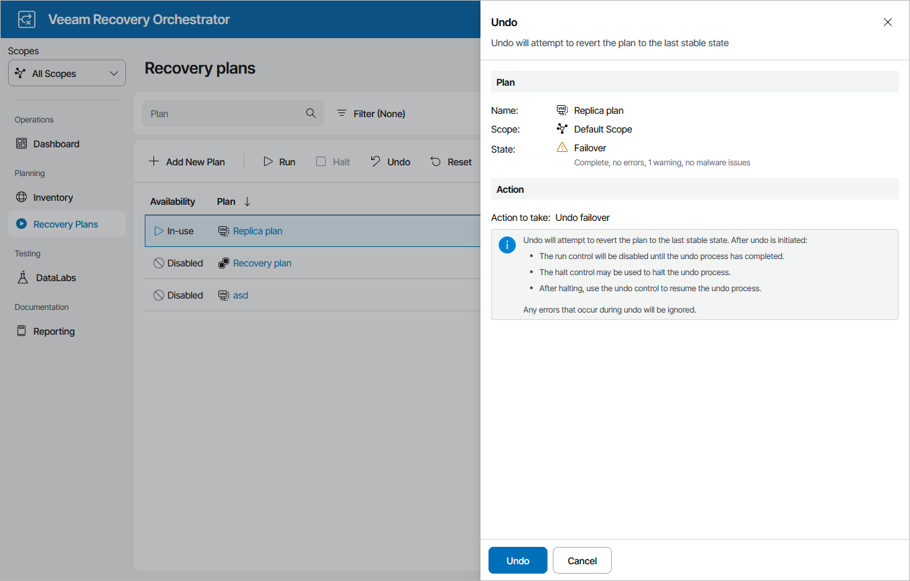

# Undoing Failover

The Undo Failover action powers off VM replicas running on target hosts and rolls back to the VM state before failover. For more information on the undo failover operation, see the Veeam Backup & Replication User Guide, section [Undo Failover](https://helpcenter.veeam.com/docs/vbr/userguide/cdp_failover_undo.html?ver=13).

To perform an undo operation for a plan in the FAILOVER state:

1. Navigate to Recovery Plans.
2. Select the plan and click Undo.
3. In the Undo window, do the following:

1. For security purposes, retype your password and click Next.
2. Review configuration information and click Undo.

If the undo failover process encounters an error while being performed, it will not be halted automatically — the plan will proceed until the process completes. To terminate the undo failover process manually, use the Halt option to stop the currently running plan as described in section [Halting Failover](halting_failover_cdp.md). To resume the undo failover process again, use the Undo option.

