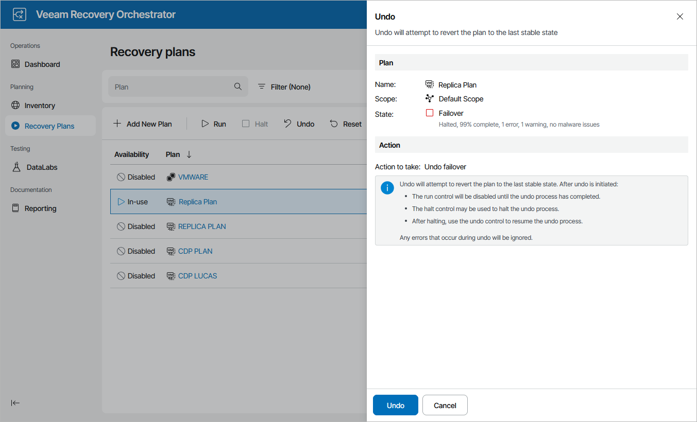

# Undoing Halted CDP Replica Plans

To perform an undo operation for a HALTED CDP replica plan:

1. Navigate to Recovery Plans.
2. Select the plan and click Undo.
3. In the Undo window, do the following:

1. For security purposes, retype your password and click Next.
2. Review configuration information and click Undo. The failover process will be started.

If a plan repeatedly enters the HALTED state due to misconfiguration or changes in the external environment, the only option left may be to [RESET](resetting_halted_cdp_plans.md) the plan.

