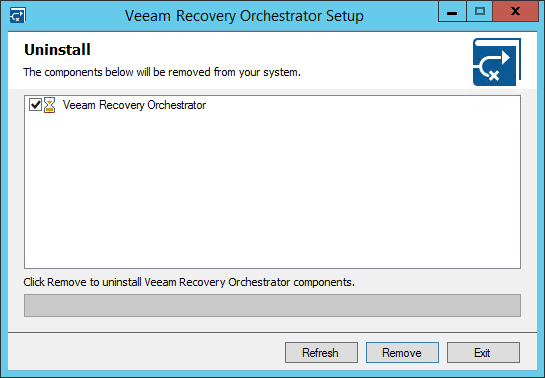

# Uninstalling Veeam Recovery Orchestrator

To uninstall Orchestrator components, perform the following steps:

1. Log in as a local Administrator to the machine where Orchestrator is installed.
2. From the Start menu, select Control Panel > Programs and Features.
3. Select Veeam Recovery Orchestrator, click Uninstall and then click Remove.

