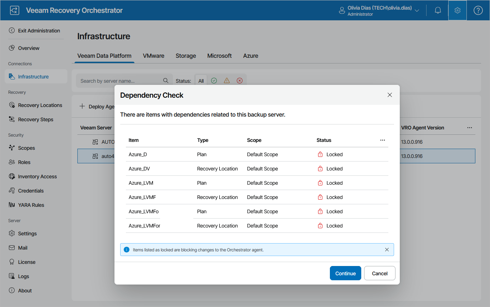
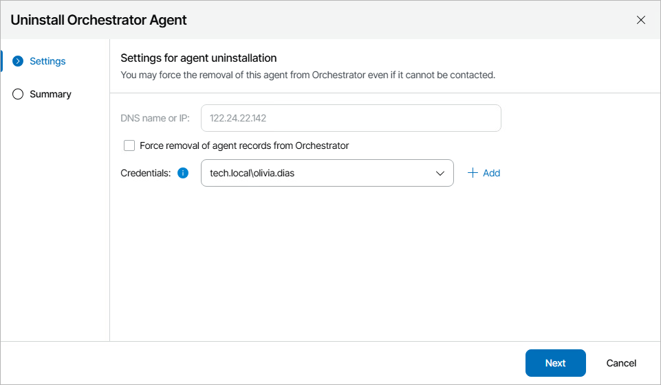
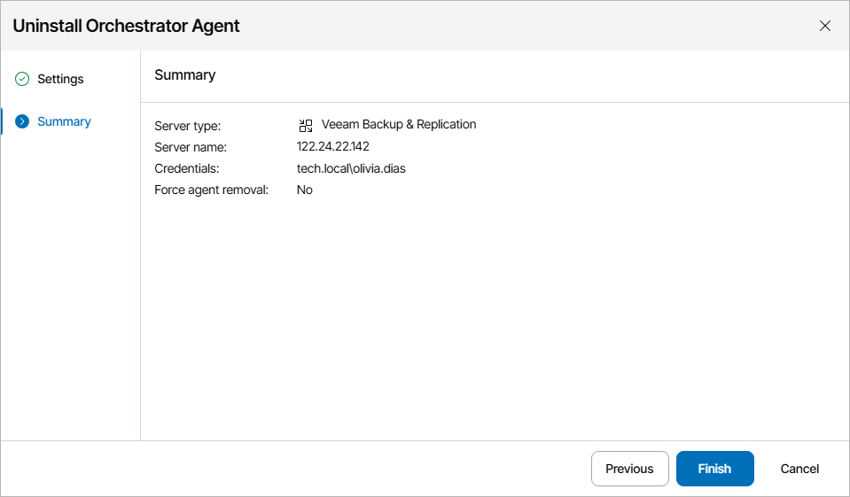

# Uninstalling Orchestrator Agents

If you no longer need a Veeam Backup & Replication server to be connected to Orchestrator, you can uninstall the Orchestrator agent running on the server.

1. Select the Orchestrator agent and click Uninstall Agent.
2. The Dependency Check window will inform you if any DataLabs or recovery plans are related to the Veeam Backup & Replication server.

* If any of the items occur to be Locked, Orchestrator will not be able to uninstall the Orchestrator agent.

In this case, wait until Orchestrator stops processing the items, power off plan testing in the locked DataLabs, reset the locked recovery plans — and then try uninstalling the Orchestrator agent again.

* If none of the items are Locked, click Continue to confirm the operation.

|  |
| --- |
| Important |
| As soon as you uninstall the Orchestrator agent from the Veeam Backup & Replication server, all its related recovery plans will no longer be able to run, and all its related DataLabs will be removed from Orchestrator.  All [template jobs](editing_template_jobs.md) and [credentials](managing_credentials.md) collected from the server will also be excluded from Orchestrator components, and the [Protect VM Group steps](protect_vm_group.md) that use any of these jobs will be removed from recovery plans as well. |

|  |
| --- |
| Note |
| You cannot uninstall an Orchestrator agent running on a Veeam Backup & Replication server that is used by any Microsoft Azure recovery location. [Modify the settings of all the related locations](configuring_recovery_locations.md) to remove references to the server — and then try uninstalling the agent again. |

1. Complete the Uninstall Orchestrator Agent wizard:

1. At the Settings step of the wizard, specify the following settings:

1. Choose whether you want to uninstall the Orchestrator agent regardless of the Veeam Backup & Replication server state.

If Orchestrator is not able to access the server, the Orchestrator agent will be removed from the Orchestrator database but will keep running on the Veeam Backup & Replication server.

1. From the Credentials drop-down list, select the necessary account for connecting to the server. For an account to be displayed in the Credentials list, it must be added to the configuration database as described in section [Adding Credentials](adding_credentials_manually.md). If you have not set up an account beforehand, click Add and follow the steps of the Add Credential wizard. For more information on the required account permissions, see [Permissions](permissions.md).

The provided credentials will be also used to launch the Orchestrator agent on the server. The user name must be specified in the DOMAIN\USERNAME or USERNAME format.

1. At the Summary step, review the configured settings and click Finish.

|  |
| --- |
| Note |
| If a Veeam Backup & Replication server is managed by Veeam Backup Enterprise Manager, you will not be able to uninstall the Orchestrator agent running on the server using the Orchestrator UI. In this case, remove the Veeam Backup & Replication server from Enterprise Manager as described in the [Veeam Backup Enterprise Manager Guide](https://helpcenter.veeam.com/docs/backup/em/adding_backup_server.html?ver=120). After you remove the server from Enterprise Manager, it will be automatically removed from Orchestrator as well. |

