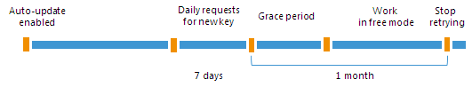
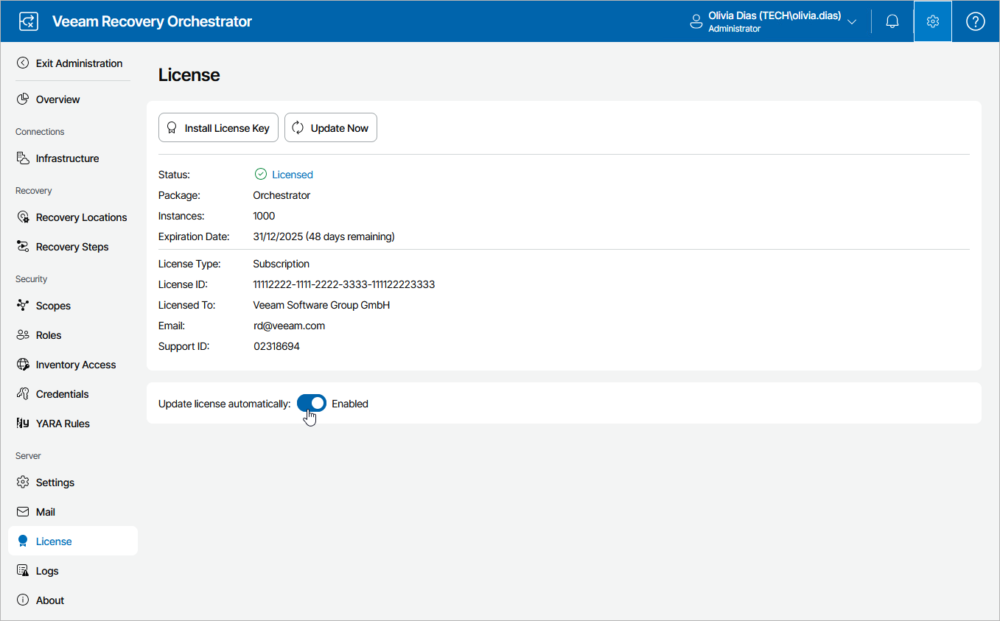

# Updating License Automatically

|  |
| --- |
| Note |
| Automatic license update is available for paid licenses only. |

You can instruct Orchestrator to update the license automatically. Automatic license update removes the need to perform license update manually every time it is about to expire. If automatic license update is enabled, Orchestrator proactively communicates with the Veeam License Update Server to obtain and install a new license before the current license expires.

* [How Automated License Update Works](#howupdateworks)
* [Automatic Update Retries](#retries)
* [Enabling Automatic License Update](#enablingupdate)

How Automated License Update Works

The process of automatic license update is performed in the following way:

1. After you enable automatic license update, Orchestrator starts sending weekly requests to the Veeam License Update Server on the Internet to check if a new license is available.
2. Seven days before expiration of the current license, Orchestrator starts sending requests once a day.
3. When a new license becomes available, Orchestrator automatically downloads and installs it to replace the old license.

Automatic Update Retries

If Orchestrator fails to update the license, it sends a notification to the contact person specified in the contract, and retries to update the license.

|  |
| --- |
| Note |
| To allow Orchestrator to send email notifications, you must connect an SMTP server that will be used for sending these notifications, as described in section [Configuring General Settings](specify_smtp_settings.md). |

Orchestrator retries to update the license key in the following way:

* If Orchestrator fails to establish a connection to the Veeam License Update Server, retry takes place every 60 minutes.
* If Orchestrator establishes a connection but the Veeam License Update Server does not return a new license key upon request, the retry takes place every 24 hours.

The retry period ends one month after the license expiration date. The retry period is equal to the number of days in the month of license expiration: for example, if the license expires in January, the retry period will be 31 days; if the license expires in April, the retry period will be 30 days.

If the retry period is over but the new license has not been installed, Orchestrator automatically disables automatic license update.

Enabling Automatic License Update with Proactive Support

By default, automatic license update is disabled. To facilitate the license update process, you must enable it.

When automatic license update is enabled, Orchestrator additionally activates proactive support. As part of support, Orchestrator periodically sends an anonymized file with the current Orchestrator configuration and statistical information to the Veeam License Update Server. This file can be used by Orchestrator product management to improve the product. No information will be shared outside of Veeam at any time.

|  |
| --- |
| Note |
| Enabling automatic license update activates [Automatic Usage Reporting](automatic_usage_reporting.md). You cannot use automatic license update without automatic usage reporting. |

To enable automatic license update:

1. Switch to the Administration page.
2. Navigate to License.
3. Set the Update license automatically toggle to On.

