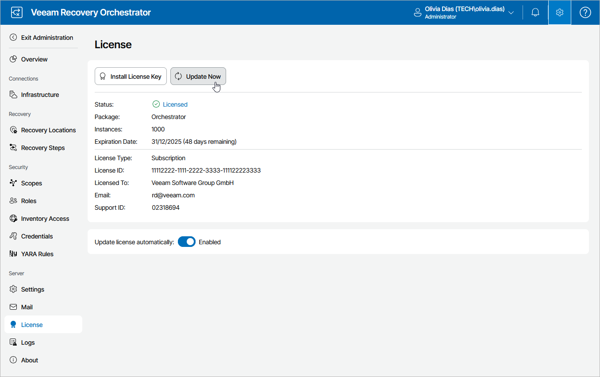

# Updating License Manually

You can update the Orchestrator license from the Veeam License Update Server manually, on demand. When you update the license manually, Orchestrator connects to the Veeam License Update Server on the Internet, downloads a new license (if the license is available) and installs it to replace the old license.

To update the license manually:

1. Switch to the Administration page.
2. Navigate to License.
3. Click Update Now.

Orchestrator will connect to the Veeam License Update Server on the Internet, download a new product license from it (if available), install it, and display a dialog box with the license update status.

1. In the displayed dialog box, click OK to acknowledge the license update result.

Manual license update can complete with the following results:

* Operation is successful. A new license key has been successfully generated, downloaded and installed.
* A new license is not required. The currently installed license key does not need to be updated.
* The Veeam License Update Server has failed to generate a new license. You will get this message if an error occurs on the Veeam License Update Server side.
* Veeam Recovery Orchestrator has received an invalid answer. You will get this message if there are connectivity issues between the Veeam License Update Server and Orchestrator server.
* Licensing by the contract has been terminated. The contract has expired. In this case, Orchestrator automatically disables automatic license update.

For more information on the occurred issues, contact your license provider.

