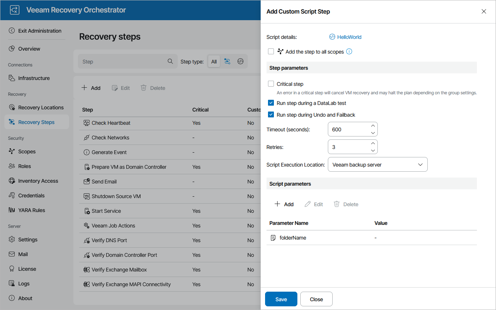

# Adding Custom Scripts

To upload an existing script into Orchestrator as a separate plan step, perform the following steps:

1. Switch to the Administration page.
2. Navigate to Recovery Steps and click Add.
3. In the Add Custom Script Step window, click the link in the Script details field.
4. In the Step Configuration window, click the link in the Script file field and browse to the script file in the Add window. You can also provide a name and description for future reference. The maximum length of the step name is 128 characters; the following characters are not supported: \* : / \ ? " < > | .
5. Click Apply.

This section will demonstrate how to upload a simple example script into Orchestrator.

|  |
| --- |
| Param(     [Parameter(Mandatory=$true)]     [string]$folderName  )    try {         $fileName = "HelloWorld.txt"     "Hello World!" | Out-File -FilePath "$folderName\$fileName"     Write-Host "File $fileName was created in folder $folderName"  }  catch {     Write-Error "Failed to create file in folder $folderName"     Write-Error $\_.Exception.Message  } |

Additionally, you can configure parameters for step execution and add any other custom parameters that your script requires.

Configuring Step Parameters

In the Step parameters section of the Add Custom Script window, do the following:

1. Choose whether you want the step to be critical for machine recovery.
2. Select the Run step during a DataLab test check box if you want the step to be executed during plan testing in a DataLab.
3. Select the Run step during Undo and Failback check box if you want the step to be executed during the Failback and Undo Failover operations.
4. In the Timeout field, specify the maximum amount of time (in seconds) for the step to execute.
5. In the Retries filed, specify the number of retries that will be attempted if the step fails on the first try.
6. From the Script Execution Location drop-down list, choose whether you want the step to be executed on the Veeam Backup & Replication server, on the Orchestrator server or on the in-guest OS.

|  |
| --- |
| Important |
| To allow the script to run inside the guest OS of a processed machine, it is required that you have Microsoft PowerShell 3.0 and .Net Framework 4.0 installed on each machine for which you enable this step. |

1. [This step applies only if the Script Execution Location parameter value is set to In-Guest OS] In the Windows Credentials field, click the link and choose credentials that will be used to gain access to the in-guest OS.

For more information on script parameters, see [Configuring Common Parameters](script_common_parameters.md).

Configuring Script Parameters

By default, Orchestrator automatically detects all mandatory parameters of uploaded scripts — but only in case these parameters are of the Credentials, Boolean, Text and Integer types. You can also add any other custom parameters that your script requires. To do that, click Add in the Script parameters section and do the following the Add Script Parameter window:

1. Select a type of the parameter that you want to add. In our example, the parameter folderName is required — that is why the parameter type will be Text.
2. Use the Parameter name and Parameter description fields to enter a name for the parameter and to provide a description for future reference. In our example, the parameter name will be folderName.
3. Enter a default value that you want to assign to the parameter. You can leave this field empty for the value to be set when the step is added to a plan.
4. Click Apply.

You can also pass runtime variables into the script. For more information, see [Using Runtime Parameter Variables](using_parameter_variables.md).

