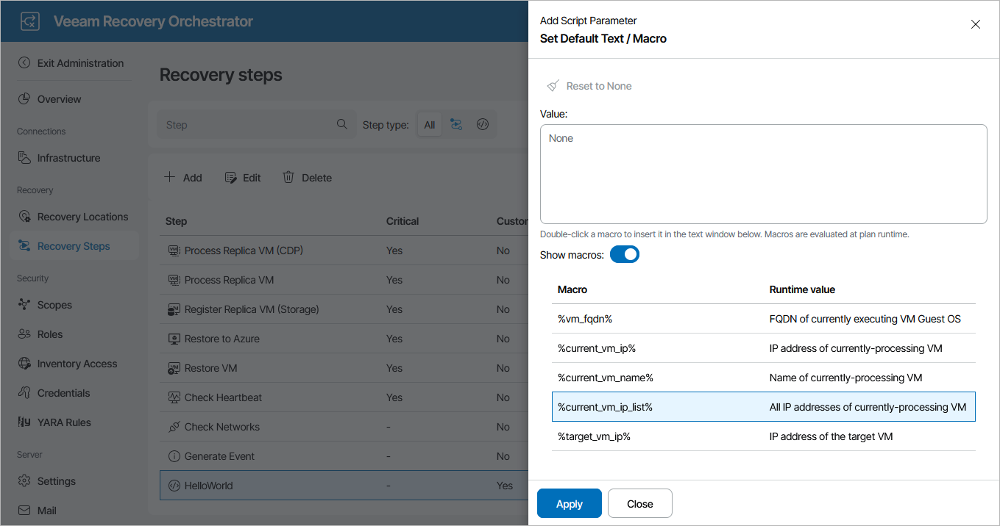

# Using Runtime Parameter Variables

Orchestrator allows you to pass runtime variables into the script.

In our example, the folderName custom parameter has been [added recently](uploading_scripts.md#script_parameters), and it is required to specify a default value for it. To set a custom variable as the default value, do the following:

1. Switch to the Administration page.
2. Navigate to Recovery Steps.
3. In the Steps column, select the script step and click Edit.
4. In the Step Editor window, click Add in the Script parameters section.
5. In the Add Script Parameter window, do the following:

1. Use the Parameter name field to enter a name for the new parameter. The maximum length of the location name is 128 characters; the following characters are not supported: \* : / \ ? " < > | .
2. From the Parameter type drop-down list, select Text / Macro.
3. In the Default value field, click Choose and do the following in the Set Default Text / Macro window:

1. Set the Show macros toggle to On
2. From the list of available variables, double-click the value that you want to assign to the parameter, and click Apply.

1. Click Apply.

1. To save changes made to the script, click Save.

For more information on parameter variables that you can pass into a script, see [Appendix A. Recovery Plan Steps](parameter_variables.md).

