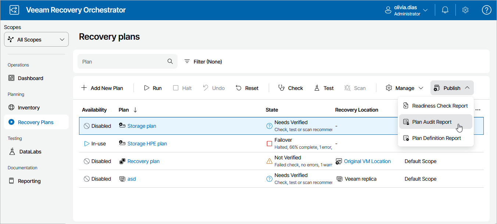
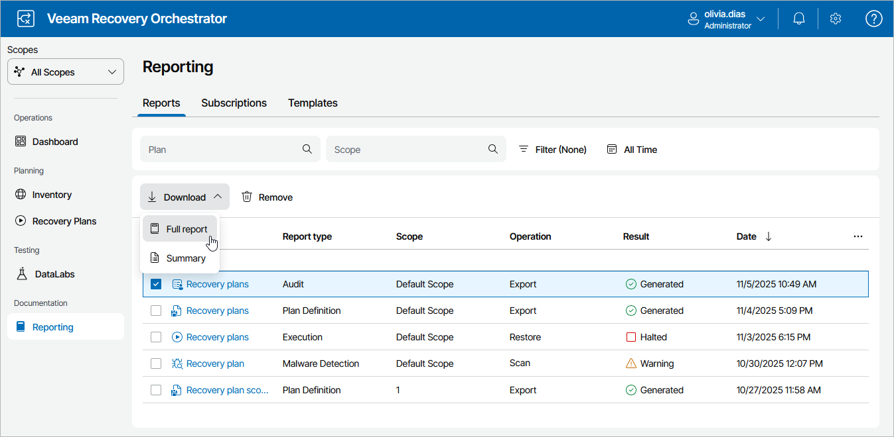
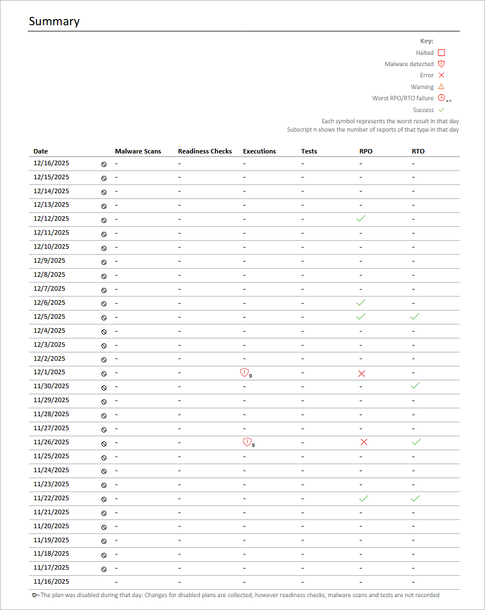

# Viewing Audit Report

The Plan Audit Report includes data on all the activity performed within the specified period. The report contains details on plan check and scan operations, provides information on plan RTO and RPO, and lists any errors encountered during plan execution.

Orchestrator generates two types of reports:

* A summary report that includes a plan overview and a summary on all the performed scan and checks.
* A full report that also includes information on each check.

Generating Plan Audit Report

By default, Orchestrator runs the Plan Audit Report automatically for every ENABLED recovery plan once a month. You can also generate the report for a plan on demand:

1. Navigate to Recovery Plans.
2. Select the plan.
3. Click Publish > Plan Audit Report.

Downloading Plan Execution History

To access the report for a recovery plan:

1. Navigate to Reporting.
2. Select the report.
3. Click the plan name to download a summary report.

-OR-

Click Download and choose whether you want to download a summary or full report.

The Plan Audit Report will use the default report template or a [custom template](managing_templates.md). The results of plan audit will be appended at the end of the template.

