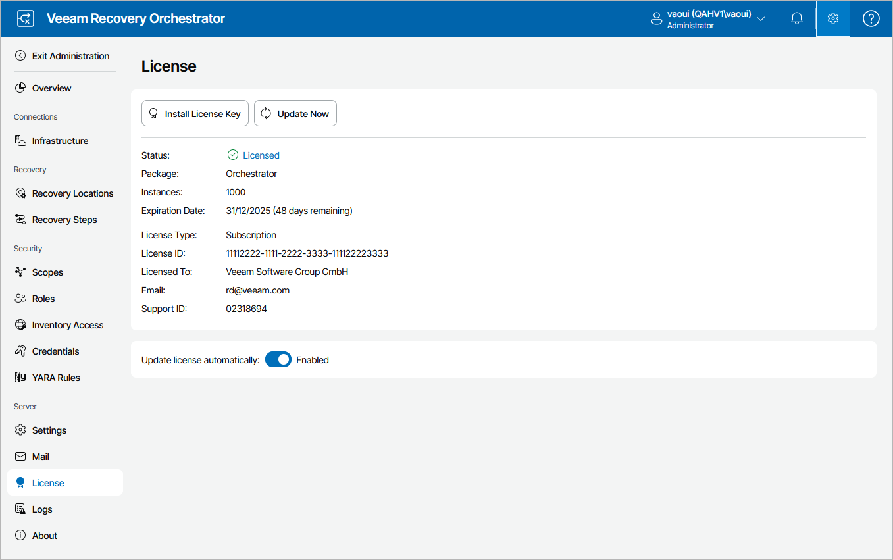

# Viewing License Details

To view Orchestrator license details:

1. Switch to the Administration page.
2. Navigate to License.

The licensing section provides general information on the currently installed Orchestrator license:

* Status — the license status. The status will depend on the license type, the number of days remaining until license expiration, the number of days remaining in the grace period (if any), and the number of machines that exceeded the allowed increase limit (if any).

Click the Details link to get more information on the number of licenses consumed by managed machines, and the number of licenses reserved for [New VMs](new_vms.md).

* Instances — the total number of licenses for machines included in the license file.
* Expiration Date — the date when the license will expire.
* License Type — the license type (Rental, Subscription, Evaluation, Perpetual, NFR).
* License ID — the ID of the provided license file (required for contacting Veeam Customer Support).
* Licensed To — the name of an organization to which the license was issued.
* Package — the software product for which the license was issued.
* Email — the email of a contact person specified in the contract.
* Support ID — the ID of the contract (required for contacting Veeam Customer Support).

