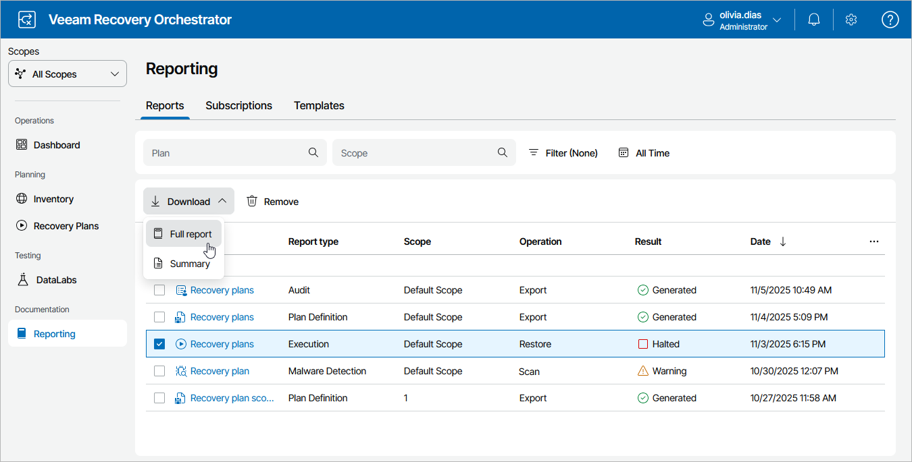
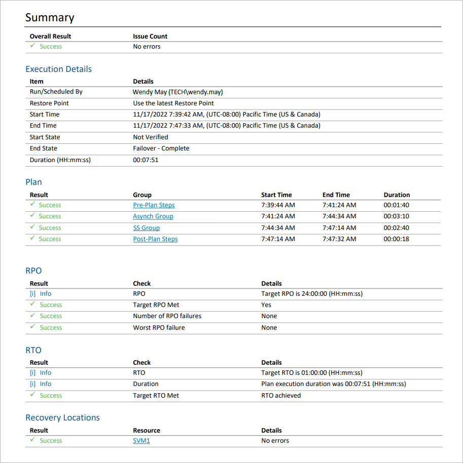

# Viewing Plan Execution History

For each executed recovery plan (that is, upon transition from one stable state to another), Orchestrator will generate the Plan Execution Report. The report contains plan performance details and provides information on each processed machine and any errors encountered during plan execution.

Orchestrator generates two types of reports:

* A summary report that includes a plan overview and a summary of inventory groups included in the plan with drill-down hyperlinks to specific machines and color-coded results of processing every plan step.
* A full report that also includes information on specific steps that will run during the recovery process. For every group, machine and step included in the plan, the processing start time and duration will be recorded.

|  |
| --- |
| Tip |
| Summary information on plan execution results over all Orchestrator scopes will be also available on the [Home Page Dashboard](home_dashboard.md). |

Downloading Plan Execution History

To access the report for a recovery plan:

1. Navigate to Reporting.
2. Select the report.
3. Click the plan name to download a summary report.

-OR-

Click Download and choose whether you want to download a summary or full report.

The Plan Execution Report will use the default report template or a [custom template](managing_templates.md). The results of plan execution will be appended at the end of the template.

