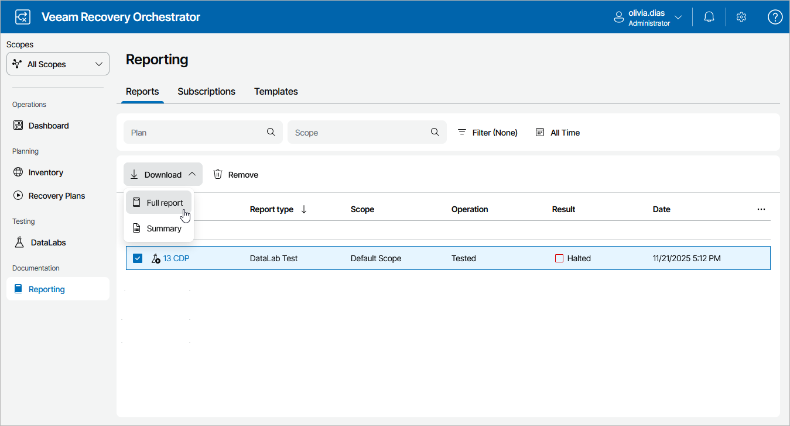
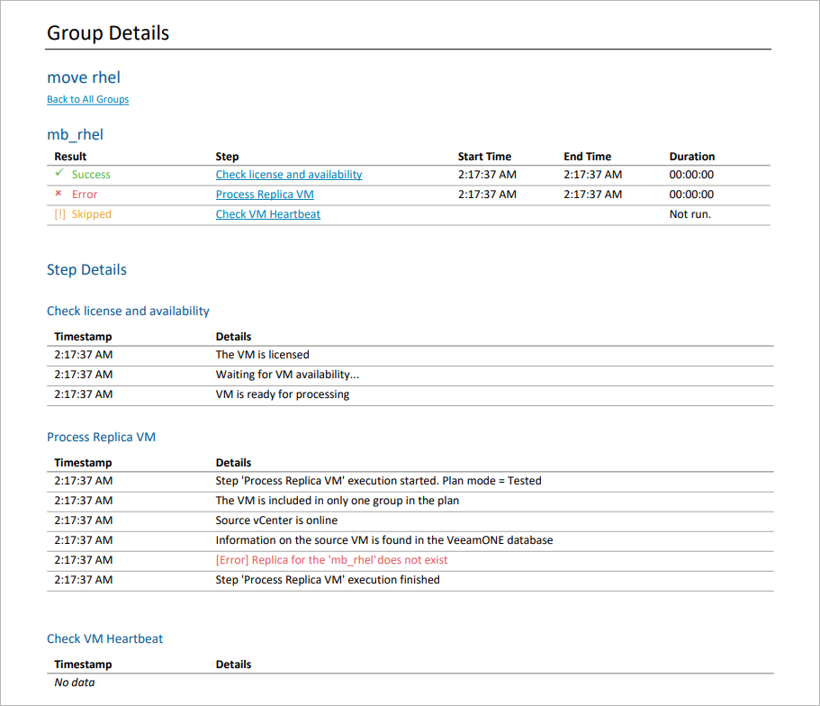

# Viewing DataLab Test Results

After you test a plan in an isolated Orchestrator DataLab, Orchestrator will generate the DataLab Test Report. The report contains test execution details and provides information on configured test environment. Summary information on plan test results for all scopes will be also available on the [Home Page Dashboard](home_dashboard.md).

Orchestrator generates two types of reports:

* A summary report that includes a plan overview and a summary of inventory groups included in the plan with drill-down hyperlinks to specific machines and color-coded results of testing every plan step.
* A full report that also includes details on the DataLab appliance and specific steps that will run during the recovery process. For every group, machine and step included in the plan, the processing start time and duration will be recorded.

|  |
| --- |
| Tip |
| Summary information on DataLab test results over all scopes will be also available on the [Home Page Dashboard](home_dashboard.md). |

Downloading DataLab Test Reports

To access the report for a recovery plan:

1. Navigate to Reporting.
2. Select the report.
3. Click the plan name to download a summary report.

-OR-

Click Download and choose whether you want to download a summary or full report.

The DataLab Test Report will use the default report template or a [custom template](managing_templates.md). The results of DataLab testing will be appended at the end of the template. The report will contain both the results of starting the DataLab and lab groups, and of testing the plan.

